# Import Data to your Lakehouse

Let's say we want to practice our knowledge on the [Get started with Real-Time Analytics in Microsoft Fabric](https://learn.microsoft.com/training/modules/get-started-kusto-fabric/?WT.mc_id=javascript-76678-cxa) module. The source material for this module is available in the [Microsoft Learn GitHub repository](https://github.com/MicrosoftDocs/learn/). In this case navigate to the module folder [learn-pr/wwl/get-started-kusto-fabric](https://github.com/MicrosoftDocs/learn/tree/main/learn-pr/wwl/get-started-kusto-fabric). There you will find an includes folder that contains the files in the module. This is a list all the modules in their respective Markdown files.

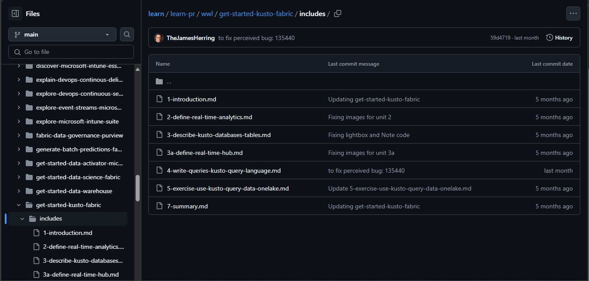

Copy the git repository URL. In this case, the URL is `https://github.com/MicrosoftDocs/learn/tree/main/learn-pr/wwl/get-started-kusto-fabric/includes`.

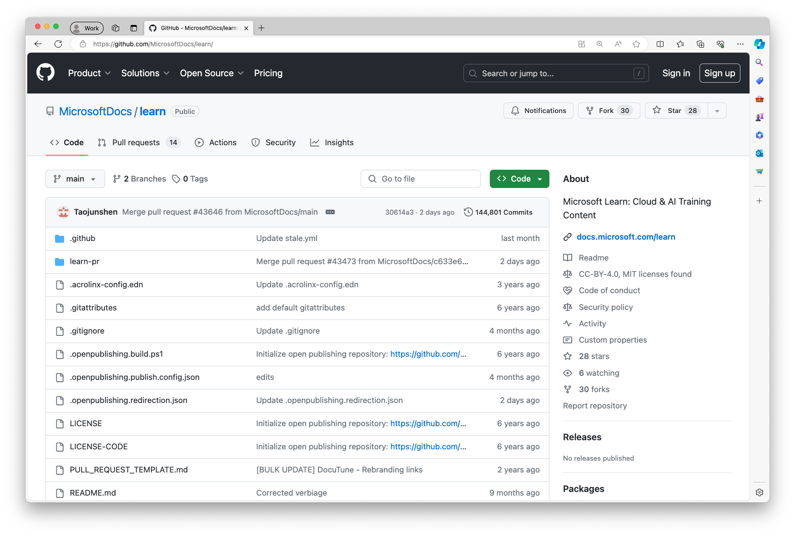

### Copy the data to your Lakehouse
Add the following code to your notebook into a new cell:
```python
# 1. Set up variables and paths
from notebookutils import mssparkutils
import requests
import os
import re
import qrcode

# ----------------- User Input -----------------

# User Input: GitHub URL (you can change this URL to any valid GitHub repository URL)
GITHUB_URL = "https://github.com/MicrosoftDocs/learn/tree/main/learn-pr/wwl/get-started-kusto-fabric/includes"

# ----------------- Parse GitHub URL -----------------

def parse_github_url(url):
    pattern = r"https://github\.com/(?P<owner>[^/]+)/(?P<repo>[^/]+)/tree/(?P<branch>[^/]+)/(?P<path>.+)"
    match = re.match(pattern, url)
    if match:
        return match.groupdict()
    else:
        raise ValueError("Invalid GitHub URL format.")

# Parse the GitHub URL
parsed_url = parse_github_url(GITHUB_URL)

OWNER = parsed_url['owner']
REPO = parsed_url['repo']

BRANCH = parsed_url['branch']
REPO_PATH = parsed_url['path']  # The path within the repo

# Define GitHub API URL
GITHUB_API_URL = "https://api.github.com/repos"

# For constructing the source URL, extract the module name
MODULE_NAME = os.path.basename(os.path.dirname(REPO_PATH))

# For local storage paths
LAKEHOUSE_FILE_PATH = "Files"
MARKDOWN_PATH = f"{LAKEHOUSE_FILE_PATH}/markdown"

# Adjust includes_folder_path
includes_folder_path = f"{MARKDOWN_PATH}/{REPO_PATH}"

# Verify the paths
print(f"includes_folder_path: {includes_folder_path}")
print(f"LEARN_MODULE_PATH: {REPO_PATH}")
print(f"MODULE_NAME: {MODULE_NAME}")

# ----------------- Download Functions -----------------

# Function to download and save files
def download_and_save_file(file_url, lakehouse_save_path):
    try:
        response = requests.get(file_url)
        if response.status_code == 200:
            # Create directories in Lakehouse if they don't exist
            dir_path = os.path.dirname(lakehouse_save_path)
            mssparkutils.fs.mkdirs(dir_path)
            # Save the file content to Lakehouse
            mssparkutils.fs.put(lakehouse_save_path, response.text, overwrite=True)
            print(f"Successfully downloaded {lakehouse_save_path}")
        else:
            print(f"Failed to download {file_url}: HTTP {response.status_code}")
    except Exception as e:
        print(f"Error downloading {file_url}: {e}")

# Function to recursively download contents
def download_contents(contents, base_save_path):
    for item in contents:
        if item['type'] == 'file':
            file_name = item['name']
            download_url = item['download_url']
            # Compute the relative path of the file within the module
            relative_path = item['path'].replace(REPO_PATH + '/', '')
            # Construct the Lakehouse save path
            lakehouse_save_path = f"{base_save_path}/{relative_path}"
            # Download and save the file
            download_and_save_file(download_url, lakehouse_save_path)
        elif item['type'] == 'dir':
            # Handle subdirectories recursively
            sub_dir_path = item['path']
            sub_api_url = item['url']
            sub_response = requests.get(sub_api_url)
            if sub_response.status_code == 200:
                sub_contents = sub_response.json()
                # Compute the new base save path for the subdirectory
                sub_base_save_path = f"{base_save_path}/{item['name']}"
                download_contents(sub_contents, sub_base_save_path)
            else:
                print(f"Failed to list contents of {sub_dir_path}: HTTP {sub_response.status_code}")

# Main execution
def main():
    # Construct the Lakehouse base save path for the module
    lakehouse_module_path = f"{MARKDOWN_PATH}/{REPO_PATH}"
    # Create the base directory in Lakehouse
    mssparkutils.fs.mkdirs(lakehouse_module_path)
    
    # Get the contents of the folder via GitHub API
    api_url = f"{GITHUB_API_URL}/{OWNER}/{REPO}/contents/{REPO_PATH}?ref={BRANCH}"
    response = requests.get(api_url)
    if response.status_code == 200:
        contents = response.json()
        download_contents(contents, lakehouse_module_path)
    else:
        print(f"Failed to list contents of {REPO_PATH}: HTTP {response.status_code}")
        print(f"Response: {response.text}")

# Run the main function
main()

# ----------------- List Markdown Files -----------------

# 2. List markdown files in the includes folder
if mssparkutils.fs.exists(includes_folder_path):
    file_list = mssparkutils.fs.ls(includes_folder_path)
    # Filter for markdown files
    md_files = [file_info for file_info in file_list if file_info.name.endswith('.md')]
else:
    print(f"Directory does not exist: {includes_folder_path}")
    md_files = []  # Handle the error accordingly

```

Run the cell.

Going forward, it is expected that you run each cell in the notebook to execute the code.

On the left side pane of the notebook, you should see the folder structure created in the Lakehouse. In the Explorer, select Lakehouses, then Files, and you should see the markdown folder tree structure we've just created and the markdown files in the includes folder.

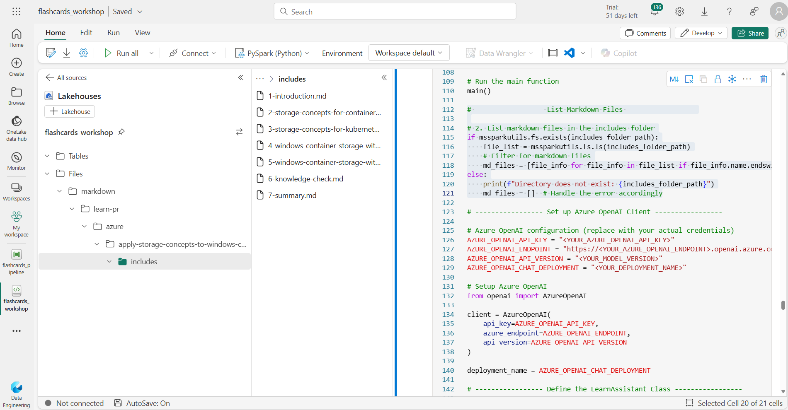

# Generate Flashcards using Azure OpenAI

Now that we have the Markdown files in our Lakehouse, we can use Azure OpenAI to generate a set of study flashcards.

## Setup Azure OpenAI 
It is expected that you have access to Azure OpenAI. 

to install the openai library, run the following command:

```python
!pip install openai
```

To set up Azure OpenAI, add the following code to your notebook in a new cell:

```python
# ----------------- Set up Azure OpenAI Client -----------------

# Azure OpenAI configuration (replace with your actual credentials)
AZURE_OPENAI_API_KEY = "<YOUR_AZURE_OPENAI_API_KEY>"
AZURE_OPENAI_ENDPOINT = "https://<YOUR_AZURE_OPENAI_ENDPOINT>.openai.azure.com/"
AZURE_OPENAI_API_VERSION = "<YOUR_MODEL_VERSION>"
AZURE_OPENAI_CHAT_DEPLOYMENT = "<YOUR_DEPLOYMENT_NAME>"

# Setup Azure OpenAI 
from openai import AzureOpenAI

client = AzureOpenAI(
    api_key=AZURE_OPENAI_API_KEY,
    azure_endpoint=AZURE_OPENAI_ENDPOINT,
    api_version=AZURE_OPENAI_API_VERSION
)

deployment_name = AZURE_OPENAI_CHAT_DEPLOYMENT
```

## Create the Flashcards Prompt 

To generate the flashcards, we need to provide a prompt to the Azure OpenAI API. The idea is to tell the model to generate questions based on the content of the Markdown files.

The flashcard PDF generator app expects a list with the following shape, containing our generated questions and answers:

```json
[
  {
    "id": "001",
    "question": "What is the history behind flashcards?",
    "answer": "Flashcards have been used as a learning tool since the 19th century, with their roots traced back to Germany.",
    "category_name": "History",
    "qr_url": "https://example.com/qrcodes/001.png"
  }
]

```

To generate a JSON like that, add the following code to your notebook in a new cell:

```python
# ----------------- Define the LearnAssistant Class -----------------

# Create the Flashcards Prompt
class LearnAssistant:

    def __init__(self, client, deployment_name):
        self._openai = client
        self._deployment_name = deployment_name

    def generate_questions(self, text):
        system_message = """
        You are an assistant designed to help people learn from tutorials. 
        You will receive a Markdown document, and extract from it pairs of questions and answers that will help the reader learn about the text. 
        Questions and answers should be based on the input text.
        Extract at least 5 different pairs of questions and answers. Questions and answers should be short.
        Output should be valid JSON format.
        Here's an example of your output format: [{"Q": "What is the name of the assistant?", "A": "Learn Assistant"}]
        """
        user_message = text

        return self.call_openai(system_message, user_message)

    def call_openai(self, system_message, user_message):
        response = self._openai.chat.completions.create(
            model=self._deployment_name,
            messages=[
                {"role": "system", "content": system_message},
                {"role": "user", "content": user_message}
            ]
        )

        return response.choices[0].message.content
```
The key part of this code is the prompt:

```python
"""You are an assistant designed to help people learn from tutorials. 
You will receive a Markdown document, and extract from it pairs of questions and answers that will help the reader learn about the text. 
Questions and answers should be based on the input text.
Extract at least 5 different pairs of questions and answers. Questions and answers should be short.
Output should be valid JSON format.
Here's an example of your output format: [{"Q": "What is the name of the assistant?", "A": "Learn Assistant"}]
"""
```

The idea is to tell the model to only generate questions and answers based on the input text. The model should generate at least 5 different pairs of questions and answers, and we provide a sample JSON format for the output, since that's what our code is going to use next.

## Generate the Flashcards
    
```python

# ----------------- Generate the Flashcards -----------------

# List to keep track of the generated QAs
import json

QAS = []
flash_card_id = 1

# Initialize the LearnAssistant
assistant = LearnAssistant(client, deployment_name)

# Loop through each markdown file
for file_info in md_files:
    file_path = file_info.path

    # Read the file content using mssparkutils.fs.head
    try:
        if file_info.size > 0:
            content = mssparkutils.fs.head(file_path, file_info.size)
        else:
            content = ''
        
        # Generate questions and answers
        gen_qas = assistant.generate_questions(content)

        # Trim the response
        gen_qas = gen_qas.strip()

        # Convert the generated questions and answers to a list
        try:
            temp = json.loads(gen_qas)
        except json.JSONDecodeError as e:
            print(f"Error decoding JSON for {file_info.name}: {e}")
            print(f"OpenAI Response: {gen_qas}")
            continue  # Skip to the next file
        
        # Get the base filename without extension
        base_name = os.path.splitext(file_info.name)[0]
        
        # Construct the source URL
        source_url = f"https://learn.microsoft.com/training/modules/{MODULE_NAME}/{base_name}"

        # Azure Storage Account (replace with your actual storage account name)
        STORAGE_ACCOUNT = "<YOUR_STORAGE_ACCOUNT_NAME>"
        
        # Create the QR code URL pointing to your Azure Blob Storage account
        qr_url = f"https://{STORAGE_ACCOUNT}.blob.core.windows.net/qrcodes/{flash_card_id}.png"
        
        # Add the generated QAs to the list
        for t in temp:
            card = {
                "id": flash_card_id, 
                "question": t["Q"], 
                "answer": t["A"], 
                "category_name": "Real-Time",
                "source_url": source_url,
                "qr_url": qr_url
            }
            QAS.append(card)
            flash_card_id += 1
    
    except Exception as e:
        print(f"Error processing {file_info.name}: {e}")
        continue  # Skip to the next file

# Save the generated QAs to a JSON file in the Lakehouse
qas_json = json.dumps(QAS)

```

As the code runs, you should see the generated questions and answers in the output. The questions and answers are stored in the `QAS` list, which is then saved in the Lakehouse to a JSON file called `generated-QAs.json`.

`A way to apply [Responsible AI](https://learn.microsoft.com/legal/cognitive-services/openai/overview?WT.mc_id=javascript-76678-cxa) practices would be to review each question and answer generated by the model to ensure they are correct and relevant to the source material`

## Create the Flashcards QR Codes

Now that we have the questions and answers, we can generate QR codes for each flashcard. The QR code will point to the source material in the Microsoft Learn GitHub repository. In this way we follow [Responsible AI](https://learn.microsoft.com/legal/cognitive-services/openai/overview?WT.mc_id=javascript-76678-cxa) practices by providing the source material for each flashcard, so not only the user can learn more about the topic but also know where the LLM model got the information from.

Using the `qrcode` library we installed at the beginning, we can generate the QR codes for each flashcard. The source URL for the QR code is the URL to the Microsoft Learn module unit.


to install the qrcode library, run the following command:

```python
!pip install qrcode
```
Add the following code to your notebook in a new cell to have a folder to store the QR codes: 

```python
# ----------------- Generate the QR Codes -----------------

# Path to store QR codes in Lakehouse
import tempfile
import qrcode

QR_CODE_PATH = f"{LAKEHOUSE_FILE_PATH}/qrcodes"
mssparkutils.fs.mkdirs(QR_CODE_PATH)

# Loop through each flashcard and generate a QR code
for qa in QAS:
    qr = qrcode.QRCode(
        version=1,
        error_correction=qrcode.constants.ERROR_CORRECT_L,
        box_size=10,
        border=4,
    )
    qr.add_data(qa["source_url"])
    qr.make(fit=True)

    img = qr.make_image(fill_color="black", back_color="white")

    # Save the QR code image to a temporary local file
    with tempfile.NamedTemporaryFile(suffix='.png', delete=False) as tmp_file:
        img.save(tmp_file.name)
        tmp_file_path = tmp_file.name

    # Define the Lakehouse path where the QR code image will be stored
    qr_file_path = f"{QR_CODE_PATH}/{qa['id']}.png"

    # Copy the local file to the Lakehouse using mssparkutils.fs.cp()
    # The local file path needs to start with "file:"
    local_file_uri = f"file:{tmp_file_path}"

    mssparkutils.fs.cp(local_file_uri, qr_file_path, recurse=False)

    # Optionally, delete the temporary file
    os.remove(tmp_file_path)

print("Flashcards and QR codes generation completed.")

```
You should be able to message to show  modules were downloaded successfully
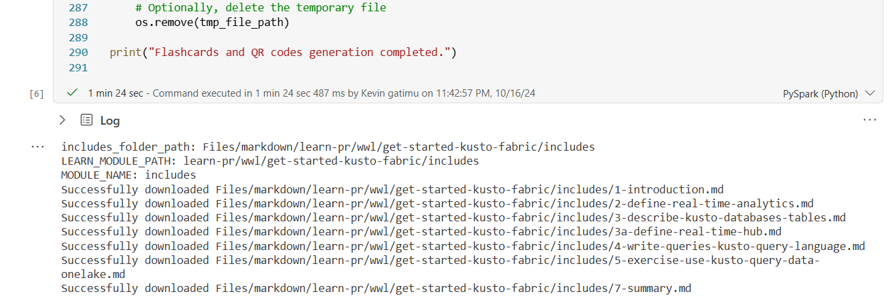

openai will generate the questions and answers for the modules


If you go back to the Lakehouse Explorer, you should see the QR codes in the qrcodes folder. Select the three dots next to the qrcodes folder and select Refresh to see the files. To see the QR codes in the qrcodes folder. Select the three dots next to the qrcodes folder and select Refresh to see the files.


To see the qr codes, run the following code:

```python
# Display all QRCODES
from pyspark.sql.functions import input_file_name
from IPython.display import Image, display

# Define the path to the QR codes in the Lakehouse
LAKEHOUSE_FILE_PATH = "Files"  # Adjust if different
QR_CODE_PATH = f"{LAKEHOUSE_FILE_PATH}/qrcodes"

# Read the QR code images as binary files
df = spark.read.format("binaryFile").load(f"{QR_CODE_PATH}/*.png")

# Collect the image data
image_data_list = df.select("content").collect()

# Display the images
for image_data_row in image_data_list:
    image_data = image_data_row.content
    display(Image(data=image_data))
```

Try scanning the QR code with your phone to see how it leads to the source material in Microsoft Learn.


# Create a Fabric Data Pipeline

Now that we have the flashcards and the QR codes, we can run a data pipeline to copy the data to an external data store (Azure Blob Storage) for public consumption.

Select the `Home` button to go back to the `Data Engineering` experience. Go to `Recommended items to create` and select `Data pipeline`. and give it a name `flashcards_pipeline`

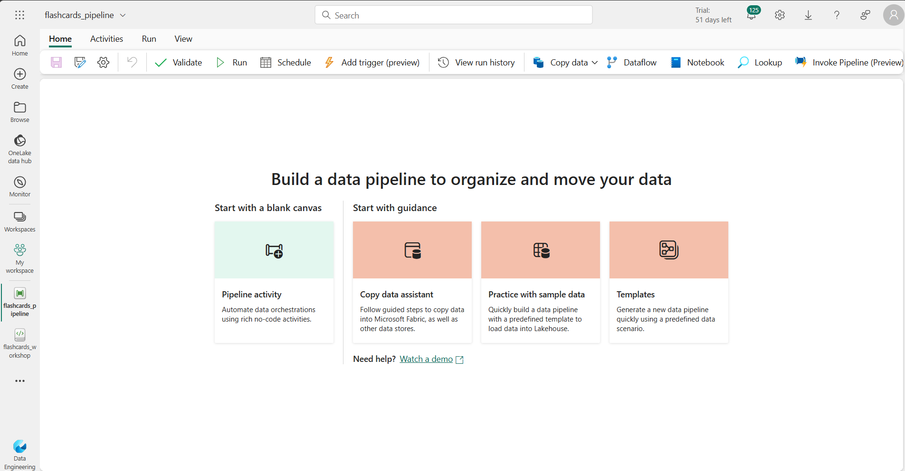

## Copy the QR Codes to Azure Blob Storage

In the pipeline, select `Pipeline activity` to start building the pipeline with a blank canvas. In the contextual menu, select "Copy data" to add a new activity.

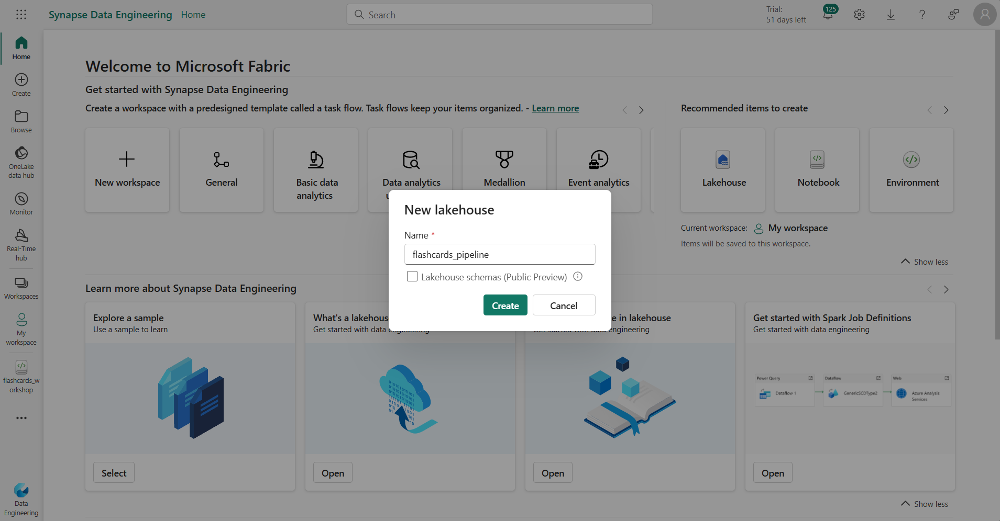

- Name the activity Copy QR Codes to Azure Blob Storage.
- Give a description of the activity.


In the source dataset, select the following options:
- Connection : select `flashcards_workshop`
- Root folder: `Files`
- File path type : `File path`
- File path: `QR Codes`
- File format: `Binary`

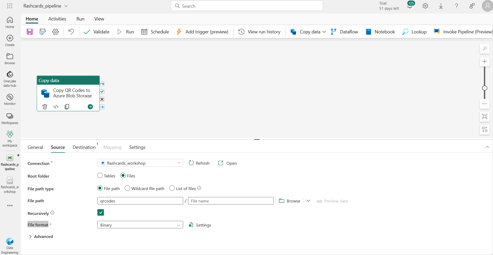

Let's shift to Azure and create a storage account to store the QR codes.

Destination : this is where we will copy the data to.

- On azure create a storage account, name = `flashcardsstorage`, Primary service = Azure Blob Storage or Azure Data Lake Storage Gen2, perfomance = Standard, Replication = Locally-redundant storage (LRS), Access tier = Hot, Networking = Public endpoint, Encryption type = Microsoft managed key, Tags = None, Review + create, Create.

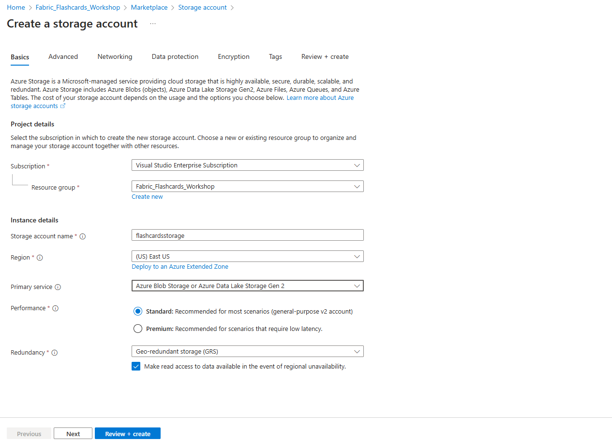

- Go to the storage account and select `Containers` and create a new container named `qr-codes` and another one `generated-QAs`.


Copy your Access key and the storage account name = `flashcardsstorage` and go back to the pipeline.


Back to the pipeline, in the destination dataset, select the following options:

- Connection : select `Azure Blob Storage`


- connect data destination: add account name = `flashcardsstorage`, authentication kind = `Account key`, Account key = `your copied access token`

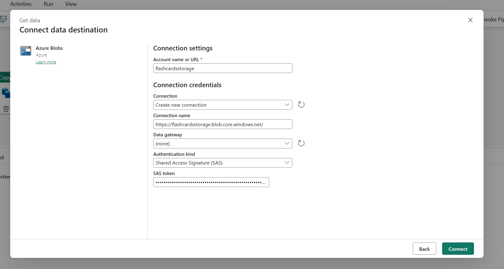

- Select the container `qr-codes` and click `OK`.

- click `Run` to save and start the pipeline.
- Make sure the pipeline runs successfully.


- Go to the storage account and select the container `qr-codes` to see the copied QR codes.


## Copy the JSON Data to Azure Blob Storage

Repeat the same process to copy the JSON data to Azure Blob Storage.
- In the same pipeline, go to `activities`, `copy data`, and `add to canvas`.
- In general, give a name = `Copy JSON file to Azure Blob Storage`, description = `Copy JSON file to Azure Blob Storage`
- Source dataset: connection = `flashcards_workshop`, root folder = `Files`, file path = generated-QAs.json, file format = `JSON`, filepath(containers) = `generated-qas`, file format = `JSON`
- Destination dataset: connection = your previous connection, file path = `generated-qas`, file format = `JSON`
- Go to home menu.
- click `Run` to save and start the pipeline.
- Make sure the pipeline runs successfully.

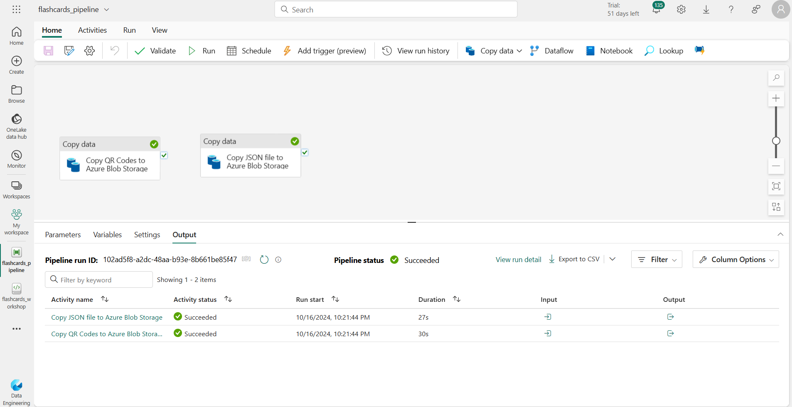

Once the pipeline is finished, you can go to your Azure Blob Storage account and see the files copied there in generated-qas container.

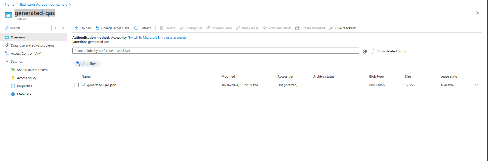