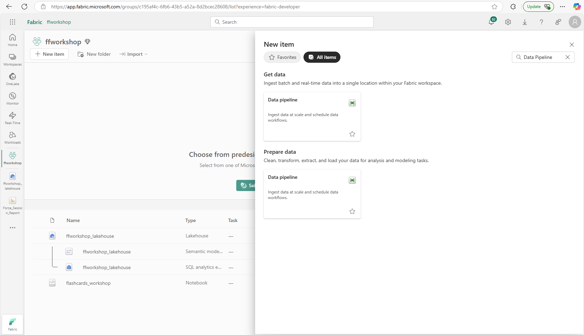

# Create Flashcards with Microsoft Fabric and Azure OpenAI

In this workshop, you will learn how to use [Microsoft Fabric](https://www.microsoft.com/microsoft-fabric) with the [Azure OpenAI Service](https://azure.microsoft.com/products/ai-services/openai-service) in [Azure AI Foundry](https://learn.microsoft.com/azure/ai-foundry/azure-openai-in-ai-foundry) to generate a set of study flashcards.  Learn how to use Microsoft Fabric with modern Retrieval-Augmented Generations (RAG) techniques and the latest foundation models in Azure AI Foundry, to develop materials to assist in your understanding of the overall Microsoft Fabric platform. 

In this example we will use [Microsoft Learn](https://learn.microsoft.com/training/) as the source material for the flashcards. 

We will fetch the Markdown files from the [Microsoft Learn GitHub repository](https://github.com/MicrosoftDocs/learn/) and import them into a Microsoft Fabric [Lakehouse](https://learn.microsoft.com/fabric/data-engineering/lakehouse-overview). 

Then we will use Azure OpenAI Service in Azure AI Foundry to generate the data that will be used as the basis for our set of study flashcards. 

Next, we will use [data pipelines](https://learn.microsoft.com/training/modules/use-data-factory-pipelines-fabric/) in Microsoft Fabric to copy the data to an external data store ([Azure Blob Storage](https://learn.microsoft.com/azure/storage/blobs/)) for public consumption. 

We will generate a static website to present your flashcards using the [GitHub Pages](https://docs.github.com/pages).


## Goals

You'll learn how to:

- Use Microsoft Fabric notebooks.
- Load data from an external data source into a Microsoft Fabric Lakehouse.
- Use Azure OpenAI Service in Azure AI Foundry to generate a set of study flashcards.
- Run data pipelines to copy the data to an external data store (Azure Blob Storage) for public consumption.
- Generate a static website using GitHub Pages to present and interact with your flashcards.

## Required Pre-requisites

| | |
|----------------------|------------------------------------------------------|
| GitHub Account | [Create your free account on GitHub](https://github.com/signup) |
| Access to Microsoft Fabric | [Accessing Microsoft Fabric for developers, startups and enterprises!](https://blog.fabric.microsoft.com/blog/accessing-microsoft-fabric-for-developers-startups-and-enterprises/) |
| A workspace in Microsoft Fabric | [Create a Microsoft Fabric workspace](https://learn.microsoft.com/fabric/data-warehouse/tutorial-create-workspace) |
| A Web browser        | [Get Microsoft Edge](https://www.microsoft.com/edge) |


## Optional Pre-requisites 

>(Note: While it is possible to complete the workshop without access to these services, it is highly recommended use them in order to experience the full functionality of this content!)

| | |
|----------------------|------------------------------------------------------|
| Azure account        | [Get a free trial Azure account](https://azure.microsoft.com/free) |
| Access to Azure OpenAI Service in Azure AI Foundry| [Azure Open AI in Azure AI Foundry](https://learn.microsoft.com/en-us/azure/ai-foundry/azure-openai-in-ai-foundry) |
| Python knowledge | [Python for beginners](https://learn.microsoft.com/training/paths/beginner-python/) |

---

# Environment Setup

## Account Provisioning

**GitHub Account** - If you do not have an active GitHub account, proceed with steps to create a GitHub account at https://github.com/signup.  This process should only take a few minutes to complete.  


**Access to Microsoft Fabric** - For those joining an in-person delivery of this workshop at FabCon, we will provide access to a Fabric tenant that will allow you access to an account that will have all of the necessary provisioning in place to complete the workshop steps.  Proctors will provide you with details on how to access your account credentials.  If you require access to a Fabric Free Trial Capacity, you can follow these [instructions](https://blog.fabric.microsoft.com/blog/accessing-microsoft-fabric-for-developers-startups-and-enterprises ) to satisfy this requirement. 

**Azure Account** - If you do not have an active Azure account setup, you should proceed to create an Azure free trial account. You can get started by visiting this [link](https://azure.microsoft.com/free).  Azure Free trial accounts do not support deployment of Azure Open AI Service on AI Foundry, we will provide pre-generated inference results to accomodate situations for those who may be unable to access this service.  Additionally, if for any reason, you are unable to create an Azure Account, you will still be able to complete a majority of the workshop content.  For those who do not have access to an Azure account, you will follow different steps to reach the end goal, this will include skipping the deployment of the Azure Open AI Service in Azure AI Foundry and skipping the deployment of the Azure Storage Account.

## Deploy Azure Open AI Service in Azure AI Foundry

**Azure Open AI Service in Azure AI Foundry** - You will use this service to generate the flashcards questions and answers.
> If you are using an Azure account that does not have access to Azure Open AI Service in Azure Foundry (Azure Free Trial accounts are not supported!), it is suggested to read the instructions that follow for completeness, then skip to the next step which covers deployment of Azure Blob Storage.

> The steps to deploy an Azure Open AI Service are described in additional detail in the [online documentation](https://learn.microsoft.com/en-us/azure/ai-services/openai/how-to/create-resource?pivots=web-portal)

1. Navigate to the [Azure Portal](https://portal.azure.com) and sign-in with your account.  Select the `Create a resource` option as shown:


2. On the resulting page, search for and click the `Create` button for the `Azure Open AI` service that is shown highlighted below:


3. Provide the following details to prepare your service for deployment:

**Subscription** - This should auto-populate based on your account settings

**Resource group** - Select `Create new` and provide a name

**Region** - Select an option from the drop-down, it is recommended to choose one in same geography as your Fabric tenant if possible

**Pricing tier** - Standard S0 is recommended


When you are ready, select `Next` to proceed.  On the resulting Network details page, ensure that you have selected option that states `All networks, including the internet, can access this resource`.  You are now able to proceed to the `Review + submit` step to finalize deployment.  When you are ready, select `Create` to begin the deployment.

4. You will now need to wait for your deployment to complete, once this has finished, navigate to your newly deployed resource by selecting `Go to resource` on the resulting page.  If you have lost your way, you can always find your deployed service by navigating to the Resource Group that was selected for deployment in the previous step.  Once successfully navigated, click the `Explore Azure AI Foundry portal` link on the overview page as shown:


5. Once you have completed navigation to [Azure AI Foundry](https://ai.azure.com/), select `Shared resources => Deployments`, the select `Deploy model` and select the `Deploy base model` option as shown:


6. You will now be provided a number of options, we are specifically interested in deploying a model that supports the `Chat completion` task.  At time of writing, `gpt-4o` is considered a good option.  Select this model and select `Confirm` to proceed.


7. On the resulting screen, leave options as they are with `Deployment type` set to `Global Standard` then select `Deploy` to begin the deployment.


8. You will now be navigated to your deployed instance of gpt-4o. In this screen you can find samples demonstrating how to call your Azure Open AI Service using various SDK.  In addition, you can find your `Target URI` and `Key` that can be used to make web requests that call your AI model service from client code. These will be used in later instructions to call your deployed service from a Notebook in Microsoft Fabric.


## Deploy Azure Storage Account

**Azure Storage Account** - You will use this service to store the generated flashcard content, which will be used to render flashcard content in the accompanying static web app. 
> If you do not have access to an Azure account, it is still suggested to read the instructions that follow for completeness, and then skip to the next section.  You will still be able to deploy a functional static web app, as this only requires an active GitHub account, but you will not be able to serve data to your static web app from Azure.

1.  Navigate to the [Azure Portal](https://portal.azure.com) and sign-in with your account.  Select the `Create a resource` option as shown:


2. On the resulting page, search for and click the `Create` button for the `Storage account` service that is shown highlighted below:


3. Provide the following details to prepare your service for deployment:

**Subscription** - This should auto-populate based on your account settings

**Resource group** - Select `Create new` and provide a name or select and existing Resource group

**Storage account name** - The name must be unique across all existing storage account names in Azure. It must be 3 to 24 characters long, and can contain only lowercase letters and numbers.

**Region** - Select an option from the drop-down, it is recommended to choose one in same geography as your Fabric tenant if possible

**Primary service** - Select `Azure Blob Storage or Azure Data Lake Storage Gen 2`

**Performance** - Select `Standard`

**Redundancy** - Select `Geo-redundant storage (GRS)`


It is suggested to leave all other options as they are set by default. You are now able to proceed to the `Review + submit` step to finalize deployment.  When you are ready, select `Create` to begin the deployment.

4. You will now need to wait for your deployment to complete, once this has finished, navigate to your newly deployed resource by selecting `Go to resource` on the resulting page.  If you have lost your way, you can always find your deployed service by navigating to the Resource Group that was selected for deployment in the previous step.  

5. Once you have successfully navigated to your storage account, on the left-hand side, expand `Settings` and select `Configuration`, then select `Enabled` under the option to `Allow Blob anonymous access` then select `Save` as shown:


5. Now, on the left-hand side, expand `Data management` and select `Static website`, then select `Enabled`, then select `Save` as shown:


6. Now, on the left-hand side, expand `Settings` and select `Resource sharing (CORS)`, ensure that `Blob service` is highlighted then provide the following details to to configure your web application and click `Save` as shown:

**Allowed origins** - set this value to `*`

**Allowed methods** - Select `Get` from the drop-down menu

**Allowed headers** - set this value to `*`

**Exposed headers** - set this value to `*`

**Max age** - set this value to `1800`


7. We are now done with the configuration of this service.  We will return to this resource in future steps when creating the Fabric Data Pipeline.

## Create a Microsoft Fabric Workspace

**Microsoft Fabric Workspace** -  You will use Microsoft Fabric to create a Lakehouse, run the provided notebook code, and create the Data pipeline that will copy your flashcard content to your Azure Storage account.  The workspace provides a collaborative environment within the Microsoft Fabric platform where you can organize, manage, and share data-related assets.

1. Access your Fabric instance by visiting [Microsoft Fabric online](https://app.fabric.microsoft.com), login with your credentials, and create a new Fabric-enabled workspace for this workshop. To accomplish this, on the home screen, select `New Workspace`, provide a value for `Name`, and ensure after expanding the `Advanced` section that you have selected a License mode that support creation of Fabric items as shown, then select `Apply`. 


## Create a Lakehouse in Microsoft Fabric

**Lakehouse in Microsoft Fabric** - A lakehouse in Microsoft Fabric is a data architecture platform designed to store, manage, and analyze both structured and unstructured data in a single location.

To learn more about Lakehouses in Microsoft Fabric, refer to [this Lakehouse tutorial](https://learn.microsoft.com/fabric/data-engineering/tutorial-build-lakehouse#create-a-lakehouse).

1. Create a new Lakehouse in your Microsoft Fabric workspace. To accomplish this, select `+ New item`, search for "Lakehouse" in the pane that opens, and select the `Lakehouse` item":


2. Provide a name for your Lakehouse and select "Create" as shown:


## Create a Notebook in Microsoft Fabric

**Notebook in Microsoft Fabric** - The Notebook is a primary code item for developing Apache Spark jobs and machine learning experiments.  It is a web-based interactive service in Microsoft Fabric typically used by data scientists and data engineers.

To learn more about Lakehouses in Microsoft Fabric, refer to [the online documentation](https://learn.microsoft.com/fabric/data-engineering/how-to-use-notebook).

1. You should now be in the user interface of the Lakehouse.  If you have lost your way, you can always find your Lakehouse by navigating to the Workspace that was creaeted in the previous steps. Create a new notebook by selecting `Open Notebook` and then `new notebook` from the drop down menu. 


3. Once the notebook is created, select the `Save as` icon in the upper left toolbar underneath `Home`, and save the notebook as `flashcards_workshop` as shown:


## Install required Notebook libraries

1. Resume working in your recently created / saved Notebook and add the following code to the first cell to install the required Python Packages. 

```bash
#Install required Python Packages

%pip install beautifulsoup4 #Python library for parsing data out of HTML and XML files
%pip install azure-ai-inference #Azure AI Inference client library for Python
```

 Run the cell by selecting the "Play" icon to the left of the cell.

>Note: When a notebook session is first created, non-standard libraries will not be available unless they have been installed into the session.  If you receive errors in subsequent cells mentioning these libraries as missing, you likely need to re-run this cell as this usually indicates that your session was closed (relinquishing your installed libraries).


2. Hover your mouse below the Log output to reveal the `+ Code` button, this will add an additional code cell.  Add the following code to this cell to import the packages that will be used in later cells for fetching Markdown files and processing JSON / CSV formats.  

```bash
#Package imports for fetching Markdown files and processing JSON / CSV formats

import re
import requests
import os
import json
import csv
```

Run the cell by selecting the "Play" icon to the left of the cell.

>Note: When a notebook session is first created, package imports will not be available unless they have been imported into the session.  If you receive errors in subsequent cells mentioning missing imports, you likely need  re-run this cell as this usually indicates that your session was closed (relinquishing your imported packages).


---

# Import Data to your Lakehouse

The first step is to import the data from an external source into your Lakehouse. For this workshop, we will use Microsoft Learn modules as our source material. We'll fetch the learn module Markdown files from the Microsoft Learn GitHub repository and import them into our Lakehouse.


## Setup the Lakehouse folder structure

Let's say we want to practice our knowledge on the [Get started with Real-Time Analytics in Microsoft Fabric](https://learn.microsoft.com/training/modules/get-started-kusto-fabric/) module. The source material for this module is available in the [Microsoft Learn GitHub repository](https://github.com/MicrosoftDocs/learn/). In this case navigate to the module folder [learn-pr/wwl/get-started-kusto-fabric](https://github.com/MicrosoftDocs/learn/tree/main/learn-pr/wwl/get-started-kusto-fabric). There you will find an `index.yml` file that contains the metadata for the module. This will list all the units and their respective Markdown files.


To obtain the file URL, select the `index.yml` on GitHub and select the `Raw` button. Copy the URL since you'll use it in the code below.

Add the following code to your notebook into a new cell:

```python
import requests
import os
import yaml

# learn module metadata URL
LEARN_GITHUB_BASE = "https://raw.githubusercontent.com/MicrosoftDocs/learn/main/learn-pr"
url = f"{LEARN_GITHUB_BASE}/wwl/get-started-kusto-fabric/index.yml"

# load module metadata
response = requests.get(url)
index_data = yaml.safe_load(response.content)

# print the module metadata
index_data
```

Run the cell.

<div class="warning" data-title="Note">

> Going forward, it is expected that you run each cell in the notebook to execute the code.

</div>

Now that the YAML file is loaded in the `index_data` variable, we can use it to build the folder structure in our Lakehouse.

```python
# use the module uid to calculate the folder structure of the learn module
module_uid = index_data['uid']

module_units = index_data['units']

# convert the module uid to a path
uid_to_path = module_uid.replace(".", "/")

# Path to Lakehouse Files
LAKEHOUSE_FILE_PATH="/lakehouse/default/Files"

# Path to Markdown Files
MARKDOWN_PATH=f"{LAKEHOUSE_FILE_PATH}/markdown"

# Path to Learn Module
LEARN_MODULE_PATH=f"{MARKDOWN_PATH}/{uid_to_path}"

# create folder to store our Markdown files
os.makedirs(LEARN_MODULE_PATH, exist_ok=True)

# save the index.yml file to the Lakehouse
filename = url.rsplit("/")[-1]
with open(os.path.join(LEARN_MODULE_PATH, filename), "wb") as f:
    f.write(response.content)
```

If you go back to the Microsoft Learn GitHub repository, you will see that the Markdown files are stored in the `includes` folder. Let's create an equivalent folder in our Lakehouse. 


Add the following code into a new cell:

```python
# create folder for includes (Markdown file location)
INCLUDES_PATH=f"{LEARN_MODULE_PATH}/includes"
os.makedirs(INCLUDES_PATH, exist_ok=True)
```

On the left side pane of the notebook, you should see the folder structure created in the Lakehouse. In the Explorer, select Lakehouses, then Files, and you should see the `markdown` folder tree structure we've just created.


## Fetch the markdown data

Now that we have the folder structure in place, we can start downloading the Markdown files. If you look at the units in the `index.yml` file, you will see that each unit has a unique identifier. We can use this identifier to fetch the Markdown file from the Microsoft Learn GitHub repository. 

```yaml
 'units': ['learn.wwl.get-started-kusto-fabric.introduction',
  'learn.wwl.get-started-kusto-fabric.define-real-time-analytics',
  'learn.wwl.get-started-kusto-fabric.describe-kusto-databases-tables',
  'learn.wwl.get-started-kusto-fabric.write-queries-kusto-query-language',
  'learn.wwl.get-started-kusto-fabric.exercise-use-kusto-query-data-onelake',
  'learn.wwl.get-started-kusto-fabric.knowledge-check',
  'learn.wwl.get-started-kusto-fabric.summary'],
```

So if we want to fetch the `introduction` unit, we have to build the following URL: `https://raw.githubusercontent.com/MicrosoftDocs/learn/main/learn-pr/wwl/get-started-kusto-fabric/includes/1-introduction.md`. Note that the unit identifier is prefixed with a number, which is the order of the unit in the `index.yml` file.

Add the following code into a new cell:

```python
# list to keep track of the files
file_list = []

i = 0
for u in module_units:
    i += 1
    
    # get the unit identifier (introduction, define-real-time-analytics, etc.)
    include = u.rsplit(".")[-1]

    # skip the summary, exercise, and knowledge-check units
    if include == "summary" or include == "exercise" or include == "knowledge-check":
        continue

    include_unit = f"{i}-{include}"
    
    # fetch module includes (the actual Markdown files)
    include_url = f"{LEARN_GITHUB_BASE}/wwl/get-started-kusto-fabric/includes/{include_unit}.md"
    include_response = requests.get(include_url)

    # File name is the last part of the URL
    include_filename = include_url.rsplit("/")[-1]
    markdown_file = os.path.join(INCLUDES_PATH, include_filename)

    # Save the file to the Lakehouse
    with open(markdown_file, "wb") as f:
        f.write(include_response.content)
    
    # keep track of the files
    file_list.append({"file": markdown_file, "source": include_unit})

file_list
```

If you go back to the Lakehouse Explorer, you should see the Markdown files in the `includes` folder. Select the three dots next to the `includes` folder and select `Refresh` to see the files.


---

# Generate Flashcards using Azure OpenAI

Now that we have the Markdown files in our Lakehouse, we can use Azure OpenAI to generate a set of study flashcards.

## Setup Azure OpenAI

<div class="warning" data-title="Note">

> It is expected that you have access to Azure OpenAI, otherwise you can edit the code below to use any other OpenAI compatible API.

</div>

On your notebook, add the following code to configure the Azure OpenAI client:

```python
import openai
from notebookutils.mssparkutils.credentials import getSecret

KEYVAULT_ENDPOINT = "https://{your-vault}.vault.azure.net/"

openai.api_key = getSecret(KEYVAULT_ENDPOINT, "your-openai-keyvault-secret-key")

openai.api_base = "https://{your-openai-endpoint}.openai.azure.com/"
openai.api_type = 'azure'
openai.api_version = '2023-05-15'
deployment_name='sk-tests'
```

## Create the Flashcards Prompt

To generate the flashcards, we need to provide a prompt to the Azure OpenAI API. The idea is to tell the model to generate questions based on the content of the Markdown files.

The flashcard PDF generator app expects a list with the following shape, containing our generated questions and answers:

```json
[
  {
    "id": "001",
    "question": "What is the history behind flashcards?",
    "answer": "Flashcards have been used as a learning tool since the 19th century, with their roots traced back to Germany.",
    "category_name": "History",
    "qr_url": "https://example.com/qrcodes/001.png"
  }
]
```

To generate a JSON like that, add the following code to your notebook in a new cell:

```python
class LearnAssistant:

    _openai = None
    _deployment_name = None

    def __init__(self, openai, deployment_name):
        self.name = "Learn Assistant"
        self._openai = openai
        self._deployment_name = deployment_name

    def generate_questions(self, text):
        system_message = """
        You are an assistant designed to help people learn from tutorials. 
        You will receive a Markdown document, and extract from it pairs of questions and answers that will help the reader learn about the text. 
        Questions and answers should be based on the input text.
        Extract at least 5 different pairs of questions and answers. Questions and answers should be short.
        Output should be valid JSON format.
        Here's an example of your output format: [{"Q": "What is the name of the assistant?", "A": "Learn Assistant"}]
        """
        user_message = text

        return self.call_openai(
            self._deployment_name, 
            system_message=system_message,
            user_message=user_message
        )
    
    def call_openai(self, deployment_name, system_message, user_message):
        response = self._openai.ChatCompletion.create(
            engine=deployment_name,
            messages=[
                {"role": "system", "content": system_message},
                {"role": "user", "content": user_message}
            ]
        )

        return response['choices'][0]['message']['content']
```

The key part of this code is the prompt:

```python
"""You are an assistant designed to help people learn from tutorials. 
You will receive a Markdown document, and extract from it pairs of questions and answers that will help the reader learn about the text. 
Questions and answers should be based on the input text.
Extract at least 5 different pairs of questions and answers. Questions and answers should be short.
Output should be valid JSON format.
Here's an example of your output format: [{"Q": "What is the name of the assistant?", "A": "Learn Assistant"}]
"""
```

The idea is to tell the model to only generate questions and answers based on the input text. The model should generate at least 5 different pairs of questions and answers, and we provide a sample JSON format for the output, since that's what our code is going to use next.

## Generate the flashcards

```python
import json

# this is required for the QR code public URL generation
STORAGE_ACCOUNT="<your-storage-account-name>"

# list to keep track of the generated QAs
QAS = []

# get the module name
module_name = module_uid.split(".")[-1]
flash_card_id = 1

for entry in file_list:
  file = entry["file"]
  source = entry["source"]
  print(file)
  with open(file, "r") as f:
      input_text = f.read()
      genQas = LearnAssistant(openai, deployment_name).generate_questions(input_text)
      print(genQas)

      # convert the generated questions and answers to a list
      temp = json.loads(genQas)

      # get the module name
      module_name = module_uid.split(".")[-1]
      
      # create the source URL to the Microsoft Learn module
      source_url = f"https://learn.microsoft.com/training/modules/{module_name}/{source}"

      # create the QR code URL pointing to your Azure Blob Storage account
      qr_url = f"https://{STORAGE_ACCOUNT}.blob.core.windows.net/qrcodes/{flash_card_id}.png"
      
      # add the module name and source URL to the QAs
      for t in temp:

          card = {
            "id": flash_card_id, 
            "question": t["Q"], 
            "answer": t["A"], 
            "category_name": "Real-Time",
            "source_url": source_url,
            "qr_url": qr_url
          }

          QAS.append(card)
          flash_card_id += 1
  
  
with open(f"{LAKEHOUSE_FILE_PATH}/generated-QAs.json", "w") as fp:
    json.dump(QAS , fp)
```

As the code runs, you should see the generated questions and answers in the output. The questions and answers are stored in the `QAS` list, which is then saved in the Lakehouse to a JSON file called `generated-QAs.json`.

<div class="information" data-title="Note">

> A way to apply [Responsible AI](https://learn.microsoft.com/legal/cognitive-services/openai/overview) practices would be to review each question and answer generated by the model to ensure they are correct and relevant to the source material.

</div>

## Create the Flashcards QR Codes

Now that we have the questions and answers, we can generate QR codes for each flashcard. The QR code will point to the source material in the Microsoft Learn GitHub repository. In this way we follow [Responsible AI practices](https://www.microsoft.com/en-us/ai/responsible-ai) by providing the source material for each flashcard, so not only the user can learn more about the topic but also know where the LLM model got the information from.

Add the following code to your notebook in a new cell to have a folder to store the QR codes:

```python
import os

# Path to QR Codes
QR_CODE_PATH = f"{LAKEHOUSE_FILE_PATH}/qrcodes"
os.makedirs(QR_CODE_PATH, exist_ok=True)
```

## Load the generated QAs

Then we import the generated QAs from the JSON file we created before:

```python
import json

with open(f"{LAKEHOUSE_FILE_PATH}/generated-QAs.json", "r") as fp:
    QAS = json.load(fp)

QAS
```

## Generate the QR codes images

Using the `qrcode` library we installed at the beginning, we can generate the QR codes for each flashcard. The source URL for the QR code is the URL to the Microsoft Learn module unit.

```python
import qrcode

for qa in QAS:
    qr = qrcode.QRCode(
        version=1,
        error_correction=qrcode.constants.ERROR_CORRECT_L,
        box_size=10,
        border=4,
    )
    qr.add_data(qa["source_url"])
    qr.make(fit=True)

    img = qr.make_image(fill_color="black", back_color="white")
    img.save(f"{QR_CODE_PATH}/{qa['id']}.png")
```
    
If you go back to the Lakehouse Explorer, you should see the QR codes in the `qrcodes` folder. Select the three dots next to the `qrcodes` folder and select `Refresh` to see the files.


Go back to your workspace, select the `flashcards_workshop` Lakehouse, and then select the `Files` tab. You should see the `qrcodes` folder with the QR codes (select `Refresh` if they are not loaded). If you select a QR code, you can see the content of the QR code in the preview pane.


Try scanning the QR code with your phone to see how it leads to the source material in Microsoft Learn.

---

# Create a Fabric Data Pipeline

Now that we have the flashcards, we can run a [data pipeline](https://learn.microsoft.com/training/modules/use-data-factory-pipelines-fabric/) to copy the data to an external data store ([Azure Blob Storage](https://learn.microsoft.com/training/modules/explore-azure-blob-storage/)) for public consumption.

Select the `Workspace` button, and select your existing workspace. In the workspace view, select `+ New item`, then find `Data pipeline` to create a new data pipeline. Name it `flashcards_pipeline`, and then select `Create`.



## Copy the JSON Data to Azure Blob Storage

In the pipeline, select "Copy data assistant" to start building the pipeline with a with a `Copy data` activity. In the next view you will configure the Copy data activity.


In the `Choose a data source` view, select the Lakehouse you previously created.
In the `Connect to data source` view, select `Files` as the root folder, then in the directory open the `final_data` folder and select `generated-QAs.json` and select **Next**. 


In the `Choose data destination` view, search and select `Azure Blobs`. 


Enter the following information about the Azure Storage account that you created in the previous step:

- Account name or URL: Storage account name 
- Connection: Create new connection
- Connection name: FlashCards Azure Blob Storage
- Data gateway: (none)
- Authentication kind: Shared Access Signature (SAS)


Create a SAS token in your Azure Blob Storage account in the Portal in the Shared Access Signature view and check Service, Container, and Object under Allowed resource types. The other default values can be left as is. Select `Generate SAS token` and copy the token to the clipboard.


In the `File path` view, select `Browse`, and then select where you want to copy the json file. For example, you can select an existing folder or define a new path named `json`  in your Azure Blob Storage account as the the destination. Select `Next`. In the next view, set the file format to `JSON` and leave the default values as they are and select `Next`. 

Review the configuration of the source and destination and confirm **Start data transfer immediately** is checked and select `Save + Run` and the pipeline will begin to run. 


You can monitor the progress of the pipeline in the `Output` tab and rename the activity to `Copy JSON file to Azure Blob Storage` in the `General` tab. 


Once the pipeline is complete, the `generated-QAs.json` will be in the configured destination of the Azure Blob Storage account.


---
# Publish the Flashcards to a Web App

In your Azure Blob Storage account, go to the containers pane and navigate to the `json` folder. Download the `generated-QAs.json` file to your local machine.


## Prepare Web App for deployment

Navigate to the [Flashcards Web App repository](https://github.com/videlalvaro/fabcon-flashcards-workshop-site) and fork the repository.


In the forked repository, locate `generated-QAs.json` on your local machine, then upload it to the root of the `src` folder.


## Change the source of the generated QAs

You will update the web app to use `generated-QAs.json` as the data source of the web app. 

In `src/app/page.tsx` of the website repository update the lines of code by commenting out the existing `QAsURL` variable, then uncomment the line below it and update the [your GitHub handle] placeholder with the GitHub handle, from the account that forked the website repository. It should look like the code below.

```javascript
//const QAsURL = "https://fabconworkshopalvidela.blob.core.windows.net/$web/generated-QAs.json"

const QAsURL = "https://raw.githubusercontent.com/[your GitHub handle]/fabcon-flashcards-workshop-site/refs/heads/main/src/generated-QAs.json"
```

## Enable GitHub Pages

Navigate to the forked repository's settings, then navigate to **Pages** under **Code and automation**. Select GitHub Actions in the dropdown under Source. This triggers a deployment to GitHub pages. You can monitor the deployment under **Actions**. 


After deployment is complete you may navigate to the site, which can also be found in the **Pages** repository settings view.

---

# Conclusion

This concludes this workshop, we hope you enjoyed it and learned something new.

In this workshop, you learned how to use Microsoft Fabric and Azure OpenAI to generate a set of study flashcards. You connected Fabric to Azure Blob Storage to store the flashcards.

## Clean up resources

<div class="important" data-title="Important">

> After completing the workshop, remember to delete the Azure Resources you created to avoid incurring unnecessary costs!

</div>

## Resources

To learn more about Retrieval Augmented Generation (RAG) using Azure Search an Azure OpenAI, refer to the following resources:

- [Retrieval Augmented Generation (RAG) in Azure AI Search](https://learn.microsoft.com/azure/search/retrieval-augmented-generation-overview)
- [Use Azure OpenAI in Fabric with Python SDK and Synapse ML (preview)](https://learn.microsoft.com/fabric/data-science/ai-services/how-to-use-openai-sdk-synapse)
- [Azure OpenAI for big data](https://microsoft.github.io/SynapseML/docs/Explore%20Algorithms/OpenAI/)