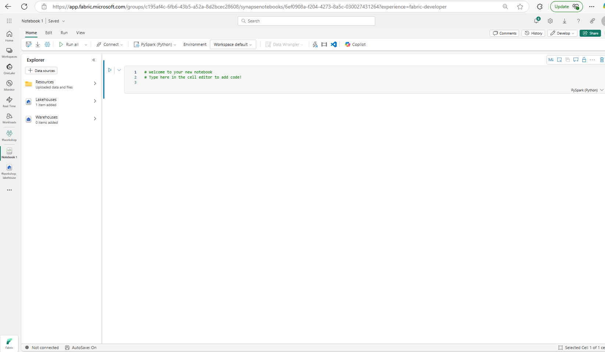
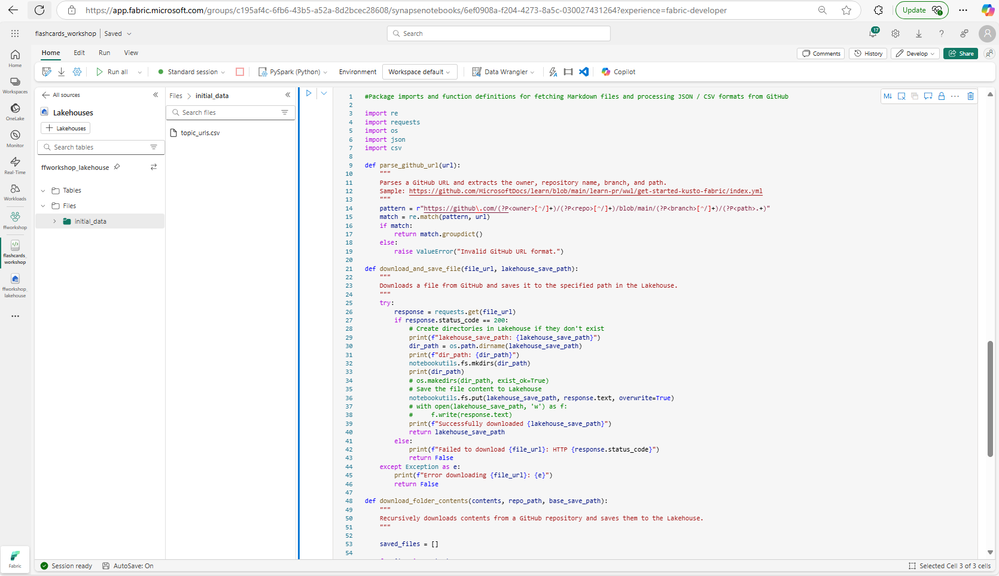
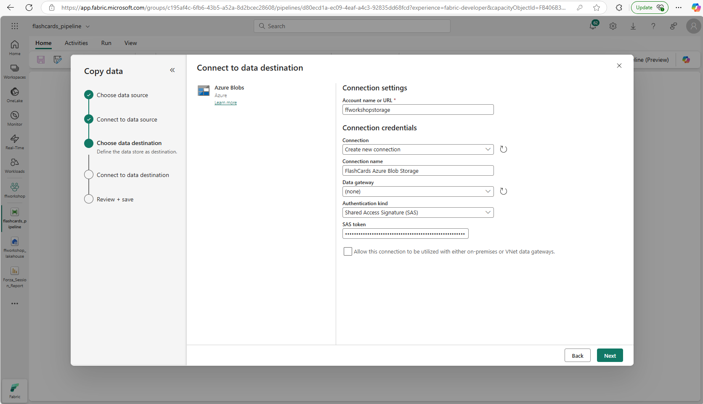
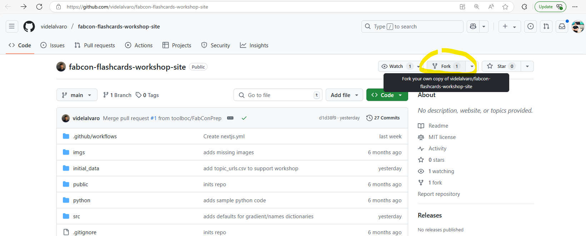

# Create Flashcards with Microsoft Fabric and Azure OpenAI

In this workshop, you will learn how to use [Microsoft Fabric](https://www.microsoft.com/microsoft-fabric) with the [Azure OpenAI Service](https://azure.microsoft.com/products/ai-services/openai-service) in [Azure AI Foundry](https://learn.microsoft.com/azure/ai-foundry/azure-openai-in-ai-foundry) to generate a set of study flashcards.  Learn how to use Microsoft Fabric with modern Retrieval-Augmented Generations (RAG) techniques and the latest foundation models in Azure AI Foundry, to develop materials to assist in your understanding of the overall Microsoft Fabric platform. 

In this example we will use [Microsoft Learn](https://learn.microsoft.com/training/) as the source material for the flashcards. 

We will fetch the Markdown files from the [Microsoft Learn GitHub repository](https://github.com/MicrosoftDocs/learn/) and import them into a Microsoft Fabric [Lakehouse](https://learn.microsoft.com/fabric/data-engineering/lakehouse-overview). 

Then we will use Azure OpenAI Service in Azure AI Foundry to generate the data that will be used as the basis for our set of study flashcards. 

Next, we will use [data pipelines](https://learn.microsoft.com/training/modules/use-data-factory-pipelines-fabric/) in Microsoft Fabric to copy the data to an external data store ([Azure Blob Storage](https://learn.microsoft.com/azure/storage/blobs/)) for public consumption. 

We will generate a static website to present your flashcards using the [GitHub Pages](https://docs.github.com/pages).


## Goals

You'll learn how to:

- Use Microsoft Fabric notebooks.
- Load data from an external data source into a Microsoft Fabric Lakehouse.
- Use Azure OpenAI Service in Azure AI Foundry to generate a set of study flashcards.
- Run data pipelines to copy the data to an external data store (Azure Blob Storage) for public consumption.
- Generate a static website using GitHub Pages to present and interact with your flashcards.

## Required Pre-requisites

| | |
|----------------------|------------------------------------------------------|
| GitHub Account | [Create your free account on GitHub](https://github.com/signup) |
| Access to Microsoft Fabric | [Accessing Microsoft Fabric for developers, startups and enterprises!](https://blog.fabric.microsoft.com/blog/accessing-microsoft-fabric-for-developers-startups-and-enterprises/) |
| A workspace in Microsoft Fabric | [Create a Microsoft Fabric workspace](https://learn.microsoft.com/fabric/data-warehouse/tutorial-create-workspace) |
| A Web browser        | [Get Microsoft Edge](https://www.microsoft.com/edge) |


## Optional Pre-requisites 

>(Note: While it is possible to complete the workshop without access to these services, it is highly recommended use them in order to experience the full functionality of this content!)

| | |
|----------------------|------------------------------------------------------|
| Azure account        | [Get a free trial Azure account](https://azure.microsoft.com/free) |
| Access to Azure OpenAI Service in Azure AI Foundry| [Azure Open AI in Azure AI Foundry](https://learn.microsoft.com/en-us/azure/ai-foundry/azure-openai-in-ai-foundry) |
| Python knowledge | [Python for beginners](https://learn.microsoft.com/training/paths/beginner-python/) |

---

# Environment Setup

## Account Provisioning

**GitHub Account** - If you do not have an active GitHub account, proceed with steps to create a GitHub account at https://github.com/signup.  This process should only take a few minutes to complete.  


**Access to Microsoft Fabric** - For those joining an in-person delivery of this workshop at FabCon, we will provide access to a Fabric tenant that will allow you access to an account that will have all of the necessary provisioning in place to complete the workshop steps.  Proctors will provide you with details on how to access your account credentials.  If you require access to a Fabric Free Trial Capacity, you can follow these [instructions](https://blog.fabric.microsoft.com/blog/accessing-microsoft-fabric-for-developers-startups-and-enterprises ) to satisfy this requirement.

**Azure Account** - If you do not have an active Azure account setup, you should proceed to create an Azure free trial account. You can get started by visiting this [link](https://azure.microsoft.com/free).  Azure Free trial accounts do not support deployment of Azure Open AI Service on AI Foundry, we will provide pre-generated inference results to accommodate situations for those who may be unable to access this service.  Additionally, if for any reason, you are unable to create an Azure Account, you will still be able to complete a majority of the workshop content.  For those who do not have access to an Azure account, you will follow different steps to reach the end goal, this will include skipping the deployment of the Azure Open AI Service in Azure AI Foundry and skipping the deployment of the Azure Storage Account.

## Deploy Azure Open AI Service in Azure AI Foundry

**Azure Open AI Service in Azure AI Foundry** - You will use this service to generate the flashcards questions and answers.
> If you are using an Azure account that does not have access to Azure Open AI Service in Azure Foundry (Azure Free Trial accounts are not supported!), it is suggested to read the instructions that follow for completeness, then skip to the next step which covers deployment of Azure Blob Storage.

> The steps to deploy an Azure Open AI Service are described in additional detail in the [online documentation](https://learn.microsoft.com/en-us/azure/ai-services/openai/how-to/create-resource?pivots=web-portal)

1. Navigate to the [Azure Portal](https://portal.azure.com) and sign-in with your account.  Select the `Create a resource` option as shown:

    

2. On the resulting page, search for the `Azure Open AI` service and click the `Create` button that is shown highlighted below :

    

3. Provide the following details to prepare your service for deployment:

    **Subscription** - This should auto-populate based on your account settings

    **Resource group** - Select `Create new` and provide a name

    **Region** - Select an option from the drop-down, it is recommended to choose one in same geography as your Fabric tenant if possible

    **Pricing tier** - Standard S0 is recommended

    

    When you are ready, select `Next` to proceed.  On the resulting Network details page, ensure that you have selected option that states `All networks, including the internet, can access this resource`.  You are now able to proceed to the `Review + submit` step to finalize deployment.  When you are ready, select `Create` to begin the deployment.

4. You will need to wait for your deployment to complete, once this has completed, navigate to your newly deployed resource by selecting `Go to resource` on the resulting page.  

    <div class="tip" data-title="Tip">

    > If you have lost your way, you can always find your deployed service by navigating to the Resource Group that was selected for deployment in the previous step.  Once successfully navigated, click the `Explore Azure AI Foundry portal` link on the overview page as shown below:

    </div>

    

5. Once you have completed navigation to [Azure AI Foundry](https://ai.azure.com/), select `Shared resources => Deployments`, the select `Deploy model` and select the `Deploy base model` option as shown:

    

6. You will now be provided a number of options, we are specifically interested in deploying a model that supports the `Chat completion` task.  At time of writing, `gpt-4o` is considered a good option.  Select this model and select `Confirm` to proceed.

    

7. On the resulting screen, leave options as they are with `Deployment type` set to `Global Standard` then select `Deploy` to begin the deployment.

    

8. You will then be navigated to your deployed instance of gpt-4o. In this screen you can find samples demonstrating how to call your Azure Open AI Service using various SDK.  In addition, you can find your `Target URI` and `Key` that can be used to make web requests that call your AI model service from client code. These will be used in later instructions to call your deployed service from a Notebook in Microsoft Fabric.

    

## Deploy Azure Storage Account

**Azure Storage Account** - You will use this service to store the generated flashcard content, which will be used to render flashcard content in the accompanying static web app. 
> If you do not have access to an Azure account, it is still suggested to read the instructions that follow for completeness, and then skip to the next section.  You will still be able to deploy a functional static web app, as this only requires an active GitHub account, but you will not be able to serve data to your static web app from Azure.

1.  Navigate to the [Azure Portal](https://portal.azure.com) and sign-in with your account.  Select the `Create a resource` option as shown:

    


2. On the resulting page, search for for the `Storage account` service and click the `Create` button highlighted below:

    

3. Provide the following details to prepare your service for deployment:

    **Subscription** - This should auto-populate based on your account settings

    **Resource group** - Select `Create new` and provide a name or select and existing Resource group

    **Storage account name** - The name must be unique across all existing storage account names in Azure. It must be 3 to 24 characters long, and can contain only lowercase letters and numbers.

    **Region** - Select an option from the drop-down, it is recommended to choose one in same geography as your Fabric tenant if possible

    **Primary service** - Select `Azure Blob Storage or Azure Data Lake Storage Gen 2`

    **Performance** - Select `Standard`

    **Redundancy** - Select `Geo-redundant storage (GRS)`

    

    It is suggested to leave all other options as they are set by default. You are now able to proceed to the `Review + submit` step to finalize deployment.  When you are ready, select `Create` to begin the deployment.

4. You will need to wait for your deployment to complete, once this has finished, navigate to your newly deployed resource by selecting `Go to resource` on the resulting page.  If you have lost your way, you can always find your deployed service by navigating to the Resource Group that was selected for deployment in the previous step.  

5. Once you have successfully navigated to your storage account, on the left-hand side, expand `Settings` and select `Configuration`, then select `Enabled` under the option to `Allow Blob anonymous access` then select `Save` as shown:

    

5. On the left-hand side, expand `Data management` and select `Static website`, then select `Enabled`, then select `Save` as shown:

    

6. On the left-hand side, expand `Settings` and select `Resource sharing (CORS)`, ensure that `Blob service` is highlighted then provide the following details to configure your web application and click `Save` as shown:

    **Allowed origins** - set this value to `*`

    **Allowed methods** - Select `Get` from the drop-down menu

    **Allowed headers** - set this value to `*`

    **Exposed headers** - set this value to `*`

    **Max age** - set this value to `1800`


    

7. We are now done with the configuration of this service.  We will return to this resource in future steps when creating the Fabric Data Pipeline.

## Create a Microsoft Fabric Workspace

**Microsoft Fabric Workspace** -  You will use Microsoft Fabric to: create a Lakehouse, run the provided notebook code, and create the Data pipeline that will copy your flashcard content to your Azure Storage account.  The workspace provides a collaborative environment within the Microsoft Fabric platform where you can organize, manage, and share data-related assets.

Access your Fabric instance by visiting [Microsoft Fabric online](https://app.fabric.microsoft.com), login with your credentials, and create a new Fabric-enabled workspace for this workshop. To accomplish this, on the home screen, select `New Workspace`, provide a value for `Name`, and ensure after expanding the `Advanced` section that you have selected a License mode that support creation of Fabric items as shown, then select `Apply`. 


## Create a Lakehouse in Microsoft Fabric

**Lakehouse in Microsoft Fabric** - A lakehouse in Microsoft Fabric is a data architecture platform designed to store, manage, and analyze both structured and unstructured data in a single location.

To learn more about Lakehouses in Microsoft Fabric, refer to [this Lakehouse tutorial](https://learn.microsoft.com/fabric/data-engineering/tutorial-build-lakehouse#create-a-lakehouse).

1. Create a new Lakehouse in your Microsoft Fabric workspace. To accomplish this, select `+ New item`, search for "Lakehouse" in the pane that opens, and select the `Lakehouse` item":

    

2. Provide a name for your Lakehouse and select `Create` as shown:

    

## Create a Notebook in Microsoft Fabric

**Notebooks in Microsoft Fabric** - The Notebook is a primary code item for developing Apache Spark jobs and machine learning experiments.  It is a web-based interactive service in Microsoft Fabric typically used by data scientists and data engineers.

To learn more about Notebooks in Microsoft Fabric, refer to [the online documentation](https://learn.microsoft.com/fabric/data-engineering/how-to-use-notebook).

1. You should now be in the user interface of the Lakehouse.  If you have lost your way, you can always find your Lakehouse by navigating to the Workspace that you created in the previous steps. Create a new notebook by selecting `Open Notebook` and then `new notebook` from the drop down menu. 

    

3. Once the notebook is created, select the `Save as` icon in the upper left toolbar underneath `Home`, and save the notebook as `flashcards_workshop` as shown:

    

## Install required Notebook libraries

1. Resume working in your recently created / saved Notebook and add the following code to the first cell to install the required Python Packages. 

    ```bash
    #Install required Python Packages

    %pip install beautifulsoup4 #Python library for parsing data out of HTML and XML files
    %pip install azure-ai-inference #Azure AI Inference client library for Python
    ```

    Run the cell by selecting the "Play" icon to the left of the cell.

    <div class="info" data-title="Note">

    > When a notebook session is first created, non-standard libraries will not be available unless they have been installed into the session.  If you receive errors in subsequent cells mentioning these libraries as missing, you likely need to re-run this cell as this usually indicates that your session was closed (relinquishing your installed libraries).

    </div>


    

---

# Import and Process Data in your Lakehouse

The first step is to import the data from an external source into your Lakehouse. For this workshop, we will use Microsoft Learn modules as our source material. We'll fetch the learn module Markdown files from the Microsoft Learn GitHub repository and import them into our Lakehouse.


## Setup the Lakehouse folder structure

To begin, we will familiarize with the problem set and the underlying data.  Let's say we want to practice our knowledge on the [Get started with Real-Time Analytics in Microsoft Fabric](https://learn.microsoft.com/training/modules/get-started-kusto-fabric/) module. The source material for this module is available in the [Microsoft Learn GitHub repository](https://github.com/MicrosoftDocs/learn/). In this case navigate to the module folder [learn-pr/wwl/get-started-kusto-fabric](https://github.com/MicrosoftDocs/learn/tree/main/learn-pr/wwl/get-started-kusto-fabric). There you will find an `index.yml` file that contains the metadata for the module. This will list all the units and their respective Markdown files.  To generate our flashcards we will need to specifiy a list of learn modules that we are interested in, we will then process this list to extract all relevant data from Microsoft Learn to assist in the generation of question and answer pairs in later steps.


1. We will begin by uploading a CSV file containing a list of topics related to Microsoft Fabric along with an associated URL pointing to relevant module content on Microsoft Learn.  We have prepared a list of topics with associated learn module urls. Start by downloading the file [topic_urls.csv](https://raw.githubusercontent.com/videlalvaro/fabcon-flashcards-workshop-site/refs/heads/main/initial_data/topic_urls.csv) 

    >Note: You may need to "right-click => Save As" with filename `topic_urls.csv`

    Now, navigate to your notebook, select the `Files` folder icon in the Lakehouse explorer and right-click to reveal the options menu, from here select `New subfolder` and name this folder `initial_data`.  Expand the `Files` tab to reveal the `initial_data` folder in the Lakehouse explorer, right-click it and select `Upload => Upload files`.  Select the Folder icon in the `Upload files` pane, then navigate to the downloaded `topic_urls.csv` file and select `Upload`.  The `topic_urls.csv` should now appear in your Lakehouse within the `initial_data` folder as shown:

    

2.  Let's validate that the `topic_urls.csv` was uploaded to the appropriate location by reading the file and displaying it's contents within our notebook.  Hover your mouse below the Log output of the previous cell to reveal the `+ Code` button, this will add an new code cell in the notebook. Add the following code to your notebook in the new cell:

    ```python
    #Open uploaded topic_urls.csv to validate it is in the appropriate location and able to be read
    with open('/lakehouse/default/Files/initial_data/topic_urls.csv') as list_of_modules:
        for line in list_of_modules:
            print(line)
    ```

    Run the cell by selecting the "Play" icon to the left of the cell.

    <div class="warning" data-title="Note">

    > Going forward, it is expected that you run each cell in the notebook to execute the code.

    </div>

    

3. Add the following into a new code cell to import the packages and function definitions that will be used in later cells for fetching Markdown files from MS Learn and processing JSON / CSV formats.  

    ```bash
    #Package imports and function definitions for fetching Markdown files and processing JSON / CSV formats from GitHub

    import re
    import requests
    import os
    import json
    import csv

    def parse_github_url(url):
        """
        Parses a GitHub URL and extracts the owner, repository name, branch, and path.
        Sample: https://github.com/MicrosoftDocs/learn/blob/main/learn-pr/wwl/get-started-kusto-fabric/index.yml
        """
        pattern = r"https://github\.com/(?P<owner>[^/]+)/(?P<repo>[^/]+)/blob/main/(?P<branch>[^/]+)/(?P<path>.+)"
        match = re.match(pattern, url)
        if match:
            return match.groupdict()
        else:
            raise ValueError("Invalid GitHub URL format.")

    def download_and_save_file(file_url, lakehouse_save_path):
        """
        Downloads a file from GitHub and saves it to the specified path in the Lakehouse.
        """
        try:
            response = requests.get(file_url)
            if response.status_code == 200:
                # Create directories in Lakehouse if they don't exist
                print(f"lakehouse_save_path: {lakehouse_save_path}")
                dir_path = os.path.dirname(lakehouse_save_path)
                print(f"dir_path: {dir_path}")
                notebookutils.fs.mkdirs(dir_path)
                print(dir_path)
                # os.makedirs(dir_path, exist_ok=True)
                # Save the file content to Lakehouse
                notebookutils.fs.put(lakehouse_save_path, response.text, overwrite=True)
                # with open(lakehouse_save_path, 'w') as f:
                #     f.write(response.text)
                print(f"Successfully downloaded {lakehouse_save_path}")
                return lakehouse_save_path
            else:
                print(f"Failed to download {file_url}: HTTP {response.status_code}")
                return False
        except Exception as e:
            print(f"Error downloading {file_url}: {e}")
            return False    

    def download_folder_contents(contents, repo_path, base_save_path):
        """
        Recursively downloads contents from a GitHub repository and saves them to the Lakehouse.
        """
        
        saved_files = []
        
        for item in contents:
            file_name = item['name']
            download_url = item['download_url']
            # Compute the relative path of the file within the module
            relative_path = item['path'].replace(repo_path + '/', '')
            print(f"relative_path: {relative_path}")
            # Construct the Lakehouse save path
            lakehouse_save_path = f"{base_save_path}/{relative_path}"
            # Download and save the file
            tmp = download_and_save_file(download_url, lakehouse_save_path)
            if tmp:
                saved_files.append(tmp)
        
        return saved_files    
    ```

>Note: When a notebook session is first created, package imports and function definitions will not be available unless they have been imported / defined in the active session.  If you receive errors in subsequent cells mentioning missing imports or defs, you likely need re-run this cell as this usually indicates that your session was closed (relinquishing your imports and function definitions).



## Fetch the markdown data

1.  With our data processing functions now defined, we will use the BeautifulSoup package to parse the html content for all urls listed inside of `topic_urls.csv`, we will specifically scan the underlying metadata to produce a json document containing `module_url`, `topic`, `title`, and `index_yaml` (the link to the underlying markdown source for the module in question). Add the following to a new code cell, and run it.  The resulting output will print out the url of each module as it parses through the list and display a table showing the resulting contents of the json document (`module_metadata.json`) in a Spark DataFrame.

    ```python
    #Obtain metadata for all modules in topic_urls.csv

    import requests
    from bs4 import BeautifulSoup

    module_metadata = []

    with open('/lakehouse/default/Files/initial_data/topic_urls.csv') as list_of_modules:
        for line in list_of_modules:
            topic = line.split(",")[0]
            url = line.split(",")[1].strip()
            title = ""
            desc = ""
            index_yaml = ""
            print(url)
            
            response = requests.get(url)
            soup = BeautifulSoup(response.text, features="html.parser")

            metas = soup.find_all('meta')
            for meta in metas:
                # original_content_git_url
                # <meta name="original_content_git_url" content="https://github.com/MicrosoftDocs/learn-pr/blob/live/learn-pr/wwl/get-started-kusto-fabric/index.yml" />
                # https://github.com/MicrosoftDocs/learn-pr/blob/live/learn-pr/wwl/get-started-kusto-fabric/index.yml
                # https://github.com/MicrosoftDocs/learn/blob/main/learn-pr/wwl/get-started-kusto-fabric/index.yml
                
                if 'property' in meta.attrs and meta.attrs['property'] == 'og:title':
                    title = meta.attrs['content']
                    # print(f"Title: {title}")
                if 'property' in meta.attrs and meta.attrs['property'] == 'og:description':
                    desc = meta.attrs['content']
                    # print(f"Desc: {desc}")
                if 'name' in meta.attrs and meta.attrs['name'] == 'github_feedback_content_git_url':
                    content = meta.attrs['content']
                    index_yaml = content
                    # content = content.replace("https://github.com/MicrosoftDocs/learn/blob/main/", "")
                    # content = content.replace("/index.yml", "")

                    # file_list = list_markdown_files(f"{LEARN_PATH}/{content}/includes")
            temp = {
                "topic": topic,
                "module_url": url,
                "title": title,
                "desc": desc,
                "index_yaml": index_yaml
            }

            module_metadata.append(temp)

    with open("/lakehouse/default/Files/initial_data/module_metadata.json", "w") as f:
        json.dump(module_metadata, f)

    df = spark.read.option("multiline", "true").json("Files/initial_data/module_metadata.json")
    # df now is a Spark DataFrame containing JSON data from "Files/initial_data/module_metadata.json".
    display(df)
    ```

    

    

    The results of this cell should create a new file in the `initial_data` folder of your Lakehouse named `module_metadata.json`.  If you see these file contents in the output of the DataFrame but no file of this name listed in the Lakehouse explorer Pane, right-click the `initial_data` folder in the Lakehouse Explorer and select `Refresh`, it should now be visible.

2. We now have the url to the associated `index_yaml` files for all modules that were originally specified in `topic_urls.csv`.  These results are contained in the `module_metadata.json` produced in the previous step. Let's now loop through this list to get a full collection of all units within the module. The units contain the markdown that represents the actual content of the module.  Once we have this data in our Lakehouse, we are ready to generate Questions and Answers from the contents of the units.  To generate this list of module metadata with associated unit markdown files, create a new code cell and copy over this code snippet that pulls all associated markdown file urls (mds) for each module directly from GitHub:

    ```python
    #Obtain markdown files for all in units of each module listed in module_metadata.json

    # Define GitHub API URL
    GITHUB_API_URL = "https://api.github.com/repos"
    LAKEHOUSE_FILE_PATH = "Files"

    with open('/lakehouse/default/Files/initial_data/module_metadata.json') as list_of_modules:
        module_metadata = json.load(list_of_modules)
        module_metadata_with_mds = []
        for metadata in module_metadata:
            # GITHUB_URL = "https://github.com/MicrosoftDocs/learn/blob/main/learn-pr/wwl/get-started-lakehouses/index.yml"
            # print(line.split(",")[1])
            GITHUB_URL = metadata["index_yaml"]
            parsed_url = parse_github_url(GITHUB_URL)

            OWNER = parsed_url['owner']
            REPO = parsed_url['repo']
            BRANCH = parsed_url['branch']
            REPO_PATH = parsed_url['path']

            MODULE_NAME = os.path.dirname(REPO_PATH)
            MARKDOWN_PATH = f"{LAKEHOUSE_FILE_PATH}/markdown"

            api_url = f"{GITHUB_API_URL}/{OWNER}/{REPO}/contents/{BRANCH}/{MODULE_NAME}/includes"
            response = requests.get(api_url)
            if response.status_code == 200:
                contents = response.json()
                # print(contents)
                saved_mds = download_folder_contents(contents, REPO_PATH, MARKDOWN_PATH)
                metadata['markdowns'] = saved_mds
                module_metadata_with_mds.append(metadata)
            else:
                print(f"Failed to list contents of {REPO_PATH}: HTTP {response.status_code}")
                print(f"Response: {response.text}")
        
        with open("/lakehouse/default/Files/initial_data/module_metadata_with_mds.json", "w") as final_metadata:
            json.dump(module_metadata_with_mds, final_metadata)
            
    df = spark.read.option("multiline", "true").json("Files/initial_data/module_metadata_with_mds.json")
    # df now is a Spark DataFrame containing JSON data from "Files/initial_data/module_metadata_with_mds.json".
    display(df)
    ```

>Note: This cell usually takes about a minute or two to complete.  Additionally, this particular cell may be subject to GitHub API rate-limiting / throttling.  If many users execute this cell from a single outbound ip address, it may result in blocking of subsequent requests until the throttling is discontinued.  If delivering this content as an interactive workshop, you may want to have a pre-generated result on hand, just in case!

The results of this cell should create a new file in the `initial_data` folder of your Lakehouse named `module_metadata_with_mds.json`.  If you see these file contents in the output of the DataFrame but no file of this name listed in the Lakehouse explorer Pane, right-click the `initial_data` folder in the Lakehouse explorer and select `Refresh`, it should now be visible.
The results of this cell should also create new folder named `markdown` in the `Files` folder of the Lakhouse explorer pane.  If you do not see the `markdown` folder under the `Files` folder in the Lakehouse explorer Pane, right-click the `Files` folder in the Lakehouse explorer and select `Refresh`, it should now be visible.


---

# Generate Flashcards using Azure OpenAI Service in Azure AI Foundry

Now that we have the Markdown files in our Lakehouse, we can use Azure OpenAI to generate a set of study flashcards.

## Setup Azure OpenAI

<div class="warning" data-title="Note">

> If you are using an Azure account that does not have access to Azure Open AI Service in Azure Foundry (Azure Free Trial accounts are not supported!), it is suggested to read the instructions that follow for completeness, then skip to the next step.  

If you are at a workshop, your proctor may share an API Key to allow you access to a service that has been configured for the event. 

</div>

1. In your notebook, add the following code which is used to configure the Azure OpenAI client:

    ```python
    #Set prompts and configure Azure OpenAI client

    TASK_GUIDELINES = "Your task is help people learn from tutorials. You will receive a Markdown document, and extract from it pairs of questions and answers that will help the reader learn about the text."

    MODEL_GUIDELINES = """
    Please follow these guidelines:
    1. Questions and answers should be based on the input text.
    2. Extract at least 5 different pairs of questions and answers. Questions and answers should be short.
    3. Output should be valid JSON format.
    4. Here's an example of your output format: [{"Q": "What is the name of the assistant?", "A": "Learn Assistant"}]
    5. Output a plain array as explained above. Do not print anything else.
    """

    AZURE_OPENAI_API_KEY="<REPLACE WITH API KEY>"
    AZURE_OPENAI_ENDPOINT="<REPLACE WITH API ENDPOINT>"
    AZURE_OPENAI_API_VERSION="2024-08-01-preview"
    ```

    The idea is to tell the model to only generate questions and answers based on the input text. The model should generate at least 5 different pairs of questions and answers, and we provide a sample JSON format for the output, since our static web app will use that format to render interactive flashcards.

2. Now that we have configured the client, let's test our prompt by supplying it with the contents of one of the md files from our Lakehouse to ensure our Azure OpenAI Service is working as expected.  Copy the following into a new cell and run it:

    ```python
    #Demonstrate example QnA request using content of single md file to test Azure OpenAI API Connection

    import os
    from azure.ai.inference import ChatCompletionsClient
    from azure.ai.inference.models import SystemMessage, UserMessage
    from azure.core.credentials import AzureKeyCredential

    model_name = "gpt-4o"

    client = ChatCompletionsClient(
        endpoint=AZURE_OPENAI_ENDPOINT,
        credential=AzureKeyCredential(AZURE_OPENAI_API_KEY),
    )

    md = "Files/markdown/learn-pr/wwl/introduction-end-analytics-use-microsoft-fabric/includes/1-introduction.md"
    with open("/lakehouse/default/" + md, "r") as f:
        input_text = f.read()

    response = client.complete(
        messages=[
            SystemMessage(content=TASK_GUIDELINES),
            SystemMessage(content=MODEL_GUIDELINES),
            UserMessage(content="Here's the document:"),
            UserMessage(content=input_text)
        ],
        max_tokens=4096,
        temperature=1.0,
        top_p=1.0,
        model=model_name
    )

    print(response.choices[0].message.content)
    ```

You should see a collection of five QnA pairs generated based on the contents of the supplied markdown file:


## Generate the flashcards

1. Now we are almost ready to create flashcards by iterating through all of the markdown files that were retrieved in previous steps.  First we will define a function that wil parse the model response into CSV format.  Add the following to a code cell and execute it:

    ```python
    #Process JSON response from model and write specific data to a CSV file

    import csv

    def dump_to_csv(writer, file_metadata, md, model_response):
        try:
            qas = json.loads(model_response)
            # topic|module_url|unit_url|include_name|include_path|question|answer
            for qa in qas:
                include_name = md.split("/")[-1]
                print(f"processing: {include_name}")
                tmp = {
                    "topic": file_metadata["topic"],
                    "module_url": file_metadata["module_url"],
                    "unit_url": file_metadata["module_url"] + include_name.replace(".md", ""),
                    "include_name": include_name,
                    "include_path": md.replace("Files/markdown/", ""),
                    "question": qa["Q"],
                    "answer": qa["A"] 
                }
                writer.writerow(tmp.values())
        except json.JSONDecodeError as e:
            with open("/lakehouse/default/Files/initial_data/errors.txt", "a") as error_file:
                print(e)
                error_file.write(md)
                error_file.write(e)
                error_file.write(model_response)
    ```

    

2. With this method defined, we are now prepared to iterate through all of our markdown files and generate a full set of flashcards.  For the purposes of demonstration, we will provide code that can be uncommented to do a full pass, but will only process the first markdown file.  If you are attending a workshop, check with the proctors if you plan to execute this snippet with any modifications as it could be costly in terms of time and may render the OpenAI Service unusable if throttling is encountered.

    ```python
    #Demonstration of full loop to iterate through all markdown files and dump relevant content to CSV

    import json
    import csv

    with open("/lakehouse/default/Files/initial_data/module_metadata_with_mds.json") as f:
        file_list = json.load(f)

    csv_file = '/lakehouse/default/Files/initial_data/flashcards-noncurated.csv'

    with open(csv_file, mode='w', newline='') as file:
        writer = csv.writer(file, delimiter='|')
        # write the CSV headers
        writer.writerow(["topic", "module_url", "unit_url", "include_name", "include_path", "question", "answer"])

        # Comment the following line if you want to create a full set of flashcards instead of just one learn module
        file_list = [file_list[0]]

        for file in file_list:
            print(file)
            for md in file['markdowns']:
                with open("/lakehouse/default/" + md, "r") as f:
                    input_text = f.read()

                    response = client.complete(
                        messages=[
                            SystemMessage(content=TASK_GUIDELINES),
                            SystemMessage(content=MODEL_GUIDELINES),
                            UserMessage(content="Here's the document:"),
                            UserMessage(content=input_text)
                        ],
                        max_tokens=4096,
                        temperature=1.0,
                        top_p=1.0,
                        model=model_name
                    )
                    model_response = response.choices[0].message.content
                    dump_to_csv(writer, file, md, model_response)
                    # Also remove the following break to generate QnA pairs for all markdown files. This can take a long time to complete depending on the amount of markdown files to be processed.
                    break
    ```


    As the code runs, you should see the generated questions and answers in the output. The questions and answers are saved to a file in the `initial_data` subfolder in the Lakehouse explore named `flashcard-uncurated.csv`.  The name of this file denotes that these results have not yet gone through human review, which is not only good for quality assurance but also to ensure that [Responsible AI Guidelines](https://www.microsoft.com/ai/principles-and-approach) are employed.  If you do not see this file, hover your mouse above the `initial_data` subfolder in the Lakehouse expplorer, right-click, and select `Refresh`, it should now be visible..

    <div class="information" data-title="Note">

    > A way to apply [Responsible AI](https://learn.microsoft.com/legal/cognitive-services/openai/overview) practices would be to review each question and answer generated by the model to ensure they are correct and relevant to the source material.

    </div>

3. Let's take a look at the contents of this file by adding and running a cell with the following:

    ```python
    #View contents of generated flashcards-uncurated.csv

    import pandas as pd
    # Load data into pandas DataFrame from "/lakehouse/default/Files/initial_data/flashcards-uncurated.csv"
    df = pd.read_csv("/lakehouse/default/Files/initial_data/flashcards-uncurated.csv", delimiter="|")
    display(df)
    ```

    

## Review the generated flashcards

We need to ensure that we have generated quality results to ensure are QnA pairs are not erroneous or otherwise unfit for use as a legitimate study aid.  We will employ human-in-the-loop to validate our results before we shop them off for rendering in our static web app.

Navigate to your Lakehouse, select the `Files` tab and click `Refresh`.  You should see two folders in your Lakehouse (`initial_data` and `markdown`).  Click into `initial_data` and select `flashcards-uncurated.csv`.  Review that the content to ensure that it meets quality statndard and make any necessary modifications to the content if necessary by saving off, deleting from the lakehouse, and re-uploading back to the Lakehouse as `flashcards-uncurated.csv`.  When you are satisfied, navigate back to the `initial_data` folder and rename `flashcards-uncurated.csv` to `flashcards-curated.csv` by left-clicking the filename and selecting `Rename`.


## Prepare generated results for rendering in Static Web App

1. Navigate back to your Notebook.  Now that we have our generated QnA pairs, we need to do some minor transformations in order to prepare our data for rendering in the static Web App.  The following will generate a `topics.json` file which represents the topic for a given collection of individual questions and answers, these derive from the topic tags originating in `initial_data/topic_urls.json` that were applied to the output when producing `initial_data/module_metadata.json`.  The `topic.json` that we will create here defines the topics or categories for our Question and Answer pairs to allow us to organize them accordingly in the static web app user interface.

    ```python
    #Generate a topics.json file that defines the topics for our Question and Answer pairs 
    #Allowing us to organize them accordingly in the static web app user interface 

    import json

    topics = []

    with open("/lakehouse/default/Files/initial_data/module_metadata.json") as f:
        data = json.load(f)
        for row in data:
            # https://github.com/MicrosoftDocs/learn/blob/main/learn-pr/wwl-data-ai/get-started-with-graphql-microsoft-fabric/index.yml
            tmp = {
                "title": row['title'],
                "summary": row["desc"],
                "module": row["index_yaml"].split("/")[-2]
            }
            topics.append(tmp)

    notebookutils.fs.mkdirs("Files/final_data")
    notebookutils.fs.put("Files/final_data/topics.json", json.dumps(topics))

    df = spark.read.option("multiline", "true").json("Files/final_data/topics.json")
    # df now is a Spark DataFrame containing JSON data from "Files/final_data/topics.json".
    display(df)
    ```

    If you see these file contents in the output of the DataFrame but do not see a folder named `final_data` in the Lakehouse explorer Pane, right-click the `Files` folder in the Lakehouse Explorer and select `Refresh`, it should now be visible.
    
    


2. Next, we will generate a `generated-QAs.json` that is a full collection of all QnA pairs along with a source pointing to the url from which the question was derived during generation.  This will be used by the static web app to render actual QnA contents.  To create this file, run the following in a new code cell: 


    ```python
    #Generate a generated-QAs.json file that defines our Question and Answer pairs 
    #Allowing us to render them accordingly in the static web app user interface 

    import pandas as pd

    # Specify the path to your CSV file and the custom delimiter
    file_path = '/lakehouse/default/Files/initial_data/flashcards-curated.csv'
    delimiter = '|'  # Example delimiter

    # Read the CSV file
    df = pd.read_csv(file_path, delimiter=delimiter, header=0)

    websiteQAs = {}

    for index, row in df.iterrows():
        module_id = row['include_path'].split("/")[-3]
        if module_id not in websiteQAs:
            websiteQAs[module_id] = []
        else: 
            tmp = {
                "q": row['question'],
                "a": row['answer'],
                "source": row['include_name']
            }
            websiteQAs[module_id].append(tmp)

    notebookutils.fs.put("Files/final_data/generated-QAs.json", json.dumps(websiteQAs))

    df = spark.read.option("multiline", "true").json("Files/final_data/generated-QAs.json")
    # df now is a Spark DataFrame containing JSON data from "Files/final_data/generated-QAs.json".
    display(df)

    ```

If you see these file contents in the output of the DataFrame but do not see a file in the `final_data` folder named `generated-QAs.json` in the Lakehouse explorer Pane, right-click the `final_data` folder in the Lakehouse Explorer and select `Refresh`, it should now be visible.


---

# Create a Fabric Data Pipeline

Now that we have the flashcards, we can run a [data pipeline](https://learn.microsoft.com/training/modules/use-data-factory-pipelines-fabric/) to copy the data to an external data store ([Azure Blob Storage](https://learn.microsoft.com/training/modules/explore-azure-blob-storage/)) for public consumption.

Select the `Workspace` button, and select your existing workspace. In the workspace view, select `+ New item`, then find `Data pipeline` to create a new data pipeline. Name it `flashcards_pipeline`, and then select `Create`.


## Copy the JSON Data to Azure Blob Storage

In the pipeline, select "Copy data assistant" to start building the pipeline with a with a `Copy data` activity. In the next view you will configure the Copy data activity.


In the `Choose a data source` view, select the Lakehouse you previously created.
In the `Connect to data source` view, select `Files` as the root folder, then in the directory open the `final_data` folder and select `generated-QAs.json` and select **Next**. 


In the `Choose data destination` view, search and select `Azure Blobs`. 


Enter the following information about the Azure Storage account that you created in the previous step:

- Account name or URL: Storage account name 
- Connection: Create new connection
- Connection name: FlashCards Azure Blob Storage
- Data gateway: (none)
- Authentication kind: Shared Access Signature (SAS)



Create a SAS token in your Azure Blob Storage account in the Portal in the Shared Access Signature view and check Service, Container, and Object under Allowed resource types. The other default values can be left as is. Select `Generate SAS token` and copy the token to the clipboard.


In the `File path` view, select `Browse`, and then select where you want to copy the json file. For example, you can select an existing folder or define a new path named `json`  in your Azure Blob Storage account as the the destination. Select `Next`. In the next view, set the file format to `JSON` and leave the default values as they are and select `Next`. 

Review the configuration of the source and destination and confirm **Start data transfer immediately** is checked and select `Save + Run` and the pipeline will begin to run. 


You can monitor the progress of the pipeline in the `Output` tab and rename the activity to `Copy JSON file to Azure Blob Storage` in the `General` tab. 


Once the pipeline is complete, the `generated-QAs.json` will be in the configured destination of the Azure Blob Storage account.


---
# Publish the Flashcards to a Web App

In your Azure Blob Storage account, go to the containers pane and navigate to the `json` folder. Download the `generated-QAs.json` file to your local machine.


## Prepare Web App for deployment

Navigate to the [Flashcards Web App repository](https://github.com/videlalvaro/fabcon-flashcards-workshop-site) and fork the repository.



In the forked repository, locate `generated-QAs.json` on your local machine, then upload it to the root of the `src` folder.


## Change the source of the generated QAs

You will update the web app to use `generated-QAs.json` as the data source of the web app. 

In `src/app/page.tsx` of the website repository update the lines of code by commenting out the existing `QAsURL` variable, then uncomment the line below it and update the [your GitHub handle] placeholder with the GitHub handle, from the account that forked the website repository. It should look like the code below.

```javascript
//const QAsURL = "https://fabconworkshopalvidela.blob.core.windows.net/$web/generated-QAs.json"

const QAsURL = "https://raw.githubusercontent.com/[your GitHub handle]/fabcon-flashcards-workshop-site/refs/heads/main/src/generated-QAs.json"
```

## Enable GitHub Pages

Navigate to the forked repository's settings, then navigate to **Pages** under **Code and automation**. Select GitHub Actions in the dropdown under Source. This triggers a deployment to GitHub pages. You can monitor the deployment under **Actions**. 


After deployment is complete you may navigate to the site, which can also be found in the **Pages** repository settings view.

---

# Conclusion

This concludes this workshop, we hope you enjoyed it and learned something new.

In this workshop, you learned how to use Microsoft Fabric and Azure OpenAI to generate a set of study flashcards. You connected Fabric to Azure Blob Storage to store the flashcards.

## Clean up resources

<div class="important" data-title="Important">

> After completing the workshop, remember to delete the Azure Resources you created to avoid incurring unnecessary costs!

</div>

## Resources

To learn more about Retrieval Augmented Generation (RAG) using Azure Search an Azure OpenAI, refer to the following resources:

- [Retrieval Augmented Generation (RAG) in Azure AI Search](https://learn.microsoft.com/azure/search/retrieval-augmented-generation-overview)
- [Use Azure OpenAI in Fabric with Python SDK and Synapse ML (preview)](https://learn.microsoft.com/fabric/data-science/ai-services/how-to-use-openai-sdk-synapse)
- [Azure OpenAI for big data](https://microsoft.github.io/SynapseML/docs/Explore%20Algorithms/OpenAI/)