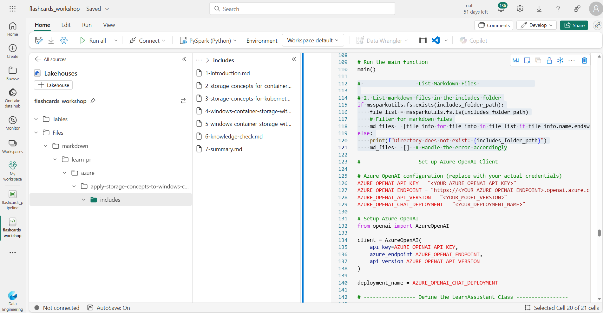

# Welcome

In this workshop, you will learn how to use Microsoft Fabric and with Azure OpenAI to generate a set of study flashcards, so you can learn new concepts in a fun and playful way. 

In this example we will use Microsoft Learn as the source material for the flashcards. We will fetch the Markdown files from the Microsoft Learn GitHub repository and import them into a Microsoft Fabric Lakehouse. Then we will use Azure OpenAI to generate a set of study flashcards. We will generate QR codes for each flashcard pointing to the source material. Finally, we will run data pipelines to copy the data to an external data store (Azure Blob Storage) for public consumption. We will generate a ready to print PDF with your flashcards.


## Goals

You'll learn how to:

- Use Microsoft Fabric notebooks.
- Load data from an external data source into a Microsoft Fabric Lakehouse.
- Use Azure OpenAI to generate a set of study flashcards.
- Generate QR codes for each flashcard pointing to the source material.
- Run data pipelines to copy the data to an external data store (Azure Blob Storage) for public consumption.
- Generate a ready to print PDF with your flashcards.

## Pre-requisites

| | |
|----------------------|------------------------------------------------------|
| Azure account        | [Get a free Azure account](https://azure.microsoft.com/free) |
| Microsoft Fabric License | [Microsoft Fabric Licenses](https://learn.microsoft.com/fabric/enterprise/licenses) |
| A workspace in Microsoft Fabric | [Create a Microsoft Fabric workspace](https://learn.microsoft.com/fabric/data-warehouse/tutorial-create-workspace) |
| Access to Azure OpenAI API | [Request access to Azure OpenAI](https://aka.ms/oaiapply) |
| A Web browser        | [Get Microsoft Edge](https://www.microsoft.com/edge) |
| Python knowledge | [Python for beginners](https://learn.microsoft.com/training/paths/beginner-python/) |

---

# Environment Setup

In Azure Portal, you need to provision the following services:

**Azure OpenAI**. You will use it to generate the flashcards questions and answers.

**Azure Blob Storage**. You will use it to store the generated flashcards and QR codes. Once you have your Storage Account provisioned, make sure you enable `Allow Blob anonymous access` in the `Configuration` tab under `Settings`. The QR codes will be publicly accessible by the PDF generator app.

**Azure Key Vault (Recommended)**. You will use it to store your Azure OpenAI API key.

**Microsoft Fabric**. Create a new workspace for this workshop. You will use it to create a Lakehouse, run the notebooks, and the Data pipeline.

## Create a Lakehouse

To create a new Lakehouse in your Microsoft Fabric workspace, open the Synapse Data Engineering experience and select the `Lakehouse` button. Provide a name of `flashcards_workshop` and select `Create`.


To learn more about Lakehouses in Microsoft Fabric, refer to [this Lakehouse tutorial](https://learn.microsoft.com/fabric/data-engineering/tutorial-build-lakehouse#create-a-lakehouse).


## Create a new notebook

Once you are in the new Lakehouse, create a new notebook by selecting `Open Notebook` and then `new notebook` from the drop down menu. 


Once the notebook is created, select the `Save as` icon and save the notebook as `flashcards_workshop`. 

## Install required libraries

Once the notebook is saved, add the following code to the first cell to install the required libraries:

```bash
%pip install qrcode
```

We are going to use the `qrcode` library to generate the QR codes for the flashcards. We do this as a first step, because once the library is installed, the notebook will automatically restart the kernel to make the library available for the rest of the code.

---

# Import Data to your Lakehouse

The first step is to import the data from an external source into your Lakehouse. For this workshop, we will use Microsoft Learn modules as our source material. We'll fetch the learn module Markdown files from the Microsoft Learn GitHub repository and import them into our Lakehouse.


## Setup the Lakehouse folder structure

Let's say we want to practice our knowledge on the [Get started with Real-Time Analytics in Microsoft Fabric](https://learn.microsoft.com/training/modules/get-started-kusto-fabric/) module. The source material for this module is available in the [Microsoft Learn GitHub repository](https://github.com/MicrosoftDocs/learn/). In this case navigate to the module folder [learn-pr/wwl/get-started-kusto-fabric](https://github.com/MicrosoftDocs/learn/tree/main/learn-pr/wwl/get-started-kusto-fabric). There you will find an `index.yml` file that contains the metadata for the module. This will list all the units and their respective Markdown files.


To obtain the file URL, select the `index.yml` on GitHub and select the `Raw` button. Copy the URL since you'll use it in the code below.

Add the following code to your notebook into a new cell:

```python
import requests
import os
import yaml

# learn module metadata URL
LEARN_GITHUB_BASE = "https://raw.githubusercontent.com/MicrosoftDocs/learn/main/learn-pr"
url = f"{LEARN_GITHUB_BASE}/wwl/get-started-kusto-fabric/index.yml"

# load module metadata
response = requests.get(url)
index_data = yaml.safe_load(response.content)

# print the module metadata
index_data
```

Run the cell.

<div class="warning" data-title="Note">

> Going forward, it is expected that you run each cell in the notebook to execute the code.

</div>

Now that the YAML file is loaded in the `index_data` variable, we can use it to build the folder structure in our Lakehouse.

```python
# use the module uid to calculate the folder structure of the learn module
module_uid = index_data['uid']

module_units = index_data['units']

# convert the module uid to a path
uid_to_path = module_uid.replace(".", "/")

# Path to Lakehouse Files
LAKEHOUSE_FILE_PATH="/lakehouse/default/Files"

# Path to Markdown Files
MARKDOWN_PATH=f"{LAKEHOUSE_FILE_PATH}/markdown"

# Path to Learn Module
LEARN_MODULE_PATH=f"{MARKDOWN_PATH}/{uid_to_path}"

# create folder to store our Markdown files
os.makedirs(LEARN_MODULE_PATH, exist_ok=True)

# save the index.yml file to the Lakehouse
filename = url.rsplit("/")[-1]
with open(os.path.join(LEARN_MODULE_PATH, filename), "wb") as f:
    f.write(response.content)
```

If you go back to the Microsoft Learn GitHub repository, you will see that the Markdown files are stored in the `includes` folder. Let's create an equivalent folder in our Lakehouse. 


Add the following code into a new cell:

```python
# create folder for includes (Markdown file location)
INCLUDES_PATH=f"{LEARN_MODULE_PATH}/includes"
os.makedirs(INCLUDES_PATH, exist_ok=True)
```

On the left side pane of the notebook, you should see the folder structure created in the Lakehouse. In the Explorer, select Lakehouses, then Files, and you should see the `markdown` folder tree structure we've just created.



## Fetch the data

Now that we have the folder structure in place, we can start downloading the Markdown files. If you look at the units in the `index.yml` file, you will see that each unit has a unique identifier. We can use this identifier to fetch the Markdown file from the Microsoft Learn GitHub repository. 

```yaml
 'units': ['learn.wwl.get-started-kusto-fabric.introduction',
  'learn.wwl.get-started-kusto-fabric.define-real-time-analytics',
  'learn.wwl.get-started-kusto-fabric.describe-kusto-databases-tables',
  'learn.wwl.get-started-kusto-fabric.write-queries-kusto-query-language',
  'learn.wwl.get-started-kusto-fabric.exercise-use-kusto-query-data-onelake',
  'learn.wwl.get-started-kusto-fabric.knowledge-check',
  'learn.wwl.get-started-kusto-fabric.summary'],
```

So if we want to fetch the `introduction` unit, we have to build the following URL: `https://raw.githubusercontent.com/MicrosoftDocs/learn/main/learn-pr/wwl/get-started-kusto-fabric/includes/1-introduction.md`. Note that the unit identifier is prefixed with a number, which is the order of the unit in the `index.yml` file.

Add the following code into a new cell:

```python
# list to keep track of the files
file_list = []

i = 0
for u in module_units:
    i += 1
    
    # get the unit identifier (introduction, define-real-time-analytics, etc.)
    include = u.rsplit(".")[-1]

    # skip the summary, exercise, and knowledge-check units
    if include == "summary" or include == "exercise" or include == "knowledge-check":
        continue

    include_unit = f"{i}-{include}"
    
    # fetch module includes (the actual Markdown files)
    include_url = f"{LEARN_GITHUB_BASE}/wwl/get-started-kusto-fabric/includes/{include_unit}.md"
    include_response = requests.get(include_url)

    # File name is the last part of the URL
    include_filename = include_url.rsplit("/")[-1]
    markdown_file = os.path.join(INCLUDES_PATH, include_filename)

    # Save the file to the Lakehouse
    with open(markdown_file, "wb") as f:
        f.write(include_response.content)
    
    # keep track of the files
    file_list.append({"file": markdown_file, "source": include_unit})

file_list
```

If you go back to the Lakehouse Explorer, you should see the Markdown files in the `includes` folder. Select the three dots next to the `includes` folder and select `Refresh` to see the files.


---

# Generate Flashcards using Azure OpenAI

Now that we have the Markdown files in our Lakehouse, we can use Azure OpenAI to generate a set of study flashcards.

## Setup Azure OpenAI

<div class="warning" data-title="Note">

> It is expected that you have access to Azure OpenAI, otherwise you can edit the code below to use any other OpenAI compatible API.

</div>

On your notebook, add the following code to configure the Azure OpenAI client:

```python
import openai
from notebookutils.mssparkutils.credentials import getSecret

KEYVAULT_ENDPOINT = "https://{your-vault}.vault.azure.net/"

openai.api_key = getSecret(KEYVAULT_ENDPOINT, "your-openai-keyvault-secret-key")

openai.api_base = "https://{your-openai-endpoint}.openai.azure.com/"
openai.api_type = 'azure'
openai.api_version = '2023-05-15'
deployment_name='sk-tests'
```

## Create the Flashcards Prompt

To generate the flashcards, we need to provide a prompt to the Azure OpenAI API. The idea is to tell the model to generate questions based on the content of the Markdown files.

The flashcard PDF generator app expects a list with the following shape, containing our generated questions and answers:

```json
[
  {
    "id": "001",
    "question": "What is the history behind flashcards?",
    "answer": "Flashcards have been used as a learning tool since the 19th century, with their roots traced back to Germany.",
    "category_name": "History",
    "qr_url": "https://example.com/qrcodes/001.png"
  }
]
```

To generate a JSON like that, add the following code to your notebook in a new cell:

```python
class LearnAssistant:

    _openai = None
    _deployment_name = None

    def __init__(self, openai, deployment_name):
        self.name = "Learn Assistant"
        self._openai = openai
        self._deployment_name = deployment_name

    def generate_questions(self, text):
        system_message = """
        You are an assistant designed to help people learn from tutorials. 
        You will receive a Markdown document, and extract from it pairs of questions and answers that will help the reader learn about the text. 
        Questions and answers should be based on the input text.
        Extract at least 5 different pairs of questions and answers. Questions and answers should be short.
        Output should be valid JSON format.
        Here's an example of your output format: [{"Q": "What is the name of the assistant?", "A": "Learn Assistant"}]
        """
        user_message = text

        return self.call_openai(
            self._deployment_name, 
            system_message=system_message,
            user_message=user_message
        )
    
    def call_openai(self, deployment_name, system_message, user_message):
        response = self._openai.ChatCompletion.create(
            engine=deployment_name,
            messages=[
                {"role": "system", "content": system_message},
                {"role": "user", "content": user_message}
            ]
        )

        return response['choices'][0]['message']['content']
```

The key part of this code is the prompt:

```python
"""You are an assistant designed to help people learn from tutorials. 
You will receive a Markdown document, and extract from it pairs of questions and answers that will help the reader learn about the text. 
Questions and answers should be based on the input text.
Extract at least 5 different pairs of questions and answers. Questions and answers should be short.
Output should be valid JSON format.
Here's an example of your output format: [{"Q": "What is the name of the assistant?", "A": "Learn Assistant"}]
"""
```

The idea is to tell the model to only generate questions and answers based on the input text. The model should generate at least 5 different pairs of questions and answers, and we provide a sample JSON format for the output, since that's what our code is going to use next.

## Generate the flashcards

```python
import json

# this is required for the QR code public URL generation
STORAGE_ACCOUNT="<your-storage-account-name>"

# list to keep track of the generated QAs
QAS = []

# get the module name
module_name = module_uid.split(".")[-1]
flash_card_id = 1

for entry in file_list:
  file = entry["file"]
  source = entry["source"]
  print(file)
  with open(file, "r") as f:
      input_text = f.read()
      genQas = LearnAssistant(openai, deployment_name).generate_questions(input_text)
      print(genQas)

      # convert the generated questions and answers to a list
      temp = json.loads(genQas)

      # get the module name
      module_name = module_uid.split(".")[-1]
      
      # create the source URL to the Microsoft Learn module
      source_url = f"https://learn.microsoft.com/training/modules/{module_name}/{source}"

      # create the QR code URL pointing to your Azure Blob Storage account
      qr_url = f"https://{STORAGE_ACCOUNT}.blob.core.windows.net/qrcodes/{flash_card_id}.png"
      
      # add the module name and source URL to the QAs
      for t in temp:

          card = {
            "id": flash_card_id, 
            "question": t["Q"], 
            "answer": t["A"], 
            "category_name": "Real-Time",
            "source_url": source_url,
            "qr_url": qr_url
          }

          QAS.append(card)
          flash_card_id += 1
  
  
with open(f"{LAKEHOUSE_FILE_PATH}/generated-QAs.json", "w") as fp:
    json.dump(QAS , fp)
```

As the code runs, you should see the generated questions and answers in the output. The questions and answers are stored in the `QAS` list, which is then saved to a JSON file in the Lakehouse.

## Generate QR Codes

Now that we have the questions and answers, we can generate QR codes for each flashcard. The QR code will point to the source material in the Microsoft Learn GitHub repository. In this way we follow [Responsible AI practices](https://www.microsoft.com/en-us/ai/responsible-ai) by providing the source material for each flashcard, so not only the user can learn more about the topic but also know where the LLM model got the information from.

Add the following code to your notebook in a new cell to have a folder to store the QR codes:

```python
import os

# Path to QR Codes
QR_CODE_PATH = f"{LAKEHOUSE_FILE_PATH}/qrcodes"
os.makedirs(QR_CODE_PATH, exist_ok=True)
```

## Load the generated QAs

Then we import the generated QAs from the JSON file we created before:

```python
import json

with open(f"{LAKEHOUSE_FILE_PATH}/generated-QAs.json", "r") as fp:
    QAS = json.load(fp)

QAS
```

## Generate the QR codes

Using the `qrcode` library we installed at the beginning, we can generate the QR codes for each flashcard. The source URL for the QR code is the URL to the Microsoft Learn module unit.

```python
import qrcode

for qa in QAS:
    qr = qrcode.QRCode(
        version=1,
        error_correction=qrcode.constants.ERROR_CORRECT_L,
        box_size=10,
        border=4,
    )
    qr.add_data(qa["source_url"])
    qr.make(fit=True)

    img = qr.make_image(fill_color="black", back_color="white")
    img.save(f"{QR_CODE_PATH}/{qa['id']}.png")
```
    
If you go back to the Lakehouse Explorer, you should see the QR codes in the `qrcodes` folder. Select the three dots next to the `qrcodes` folder and select `Refresh` to see the files.


Go back to your workspace, select the `flashcards_workshop` Lakehouse, and then select the `Files` tab. You should see the `qrcodes` folder with the QR codes (select `Refresh` if they are not loaded). If you select a QR code, you can see the content of the QR code in the preview pane.


Try scanning the QR code with your phone to see how it leads to the source material in Microsoft Learn.

---

# Run Data Pipelines

Now that we have the flashcards and the QR codes, we can run a data pipeline to copy the data to an external data store ([Azure Blob Storage](https://learn.microsoft.com/training/modules/explore-azure-blob-storage/)) for public consumption.

Select the `Home` button to go back to the Data Engineering experience. Select `Data pipeline` to create a new data pipeline. Give it the name `flashcards_pipeline`, and then select `Create`.


## Copy the QR Codes to Azure Blob Storage

In the pipeline, select "Add pipeline activity" to start building the pipeline with a blank canvas. In the contextual menu, select "Copy data" to add a new activity.

Name the activity `Copy QR Codes to Azure Blob Storage`. 

In the source dataset, select the following options:

- Data store type: `Workspace`
- Workspace data store type: `Lakehouse`
- Lakehouse: `flashcards_workshop`
- Root folder: `Files`

Then select browse and select the `qrcodes` folder. The browser should show the QR codes in the `qrcodes`. Select "OK".


In the destination, select `External`, and then `New`. In the new connection wizard, select `Azure Blob Storage` and then `Continue`. Fill in the required information to connect to your Azure Blob Storage account. 


For example:


Connection settings:

- Account name or URL: `flashcards`

Connection credentials:

- Connection: Create new connection
- Connection name: FlashCards Azure Blob Storage
- Data gateway: none
- Authentication method: Shared Access Signature (SAS)
- SAS token: `your SAS token`

Select `Create` to create the connection. You can select the `Test connection` button to verify the connection.

In File path, select `browse`, and then select the folder where you want to copy the QR codes. For example, you can create a new folder called `qrcodes` in your Azure Blob Storage account and then browse to that as you configure the destination.


Back in the pipeline editor, select the Save button to save the pipeline activity.

## Copy the JSON Data to Azure Blob Storage

Now you are going to create a new activity to copy the JSON data to Azure Blob Storage. In the activity you just create select the `Add activity` arrow button and then select `Copy data`.

Name the activity `Copy JSON file to Azure Blob Storage`. Setup the source dataset like in the previous activity, but this time select the `generated-QAs.json` file.

In the destination, select the same Azure Blob Storage account you created before, and then select the folder where you want to copy the JSON file, fir example, a folder called `json`. Save the pipeline.

## Run the pipeline

Select the `Run` button to run the pipeline. You can monitor the progress of the pipeline in the `Output` tab. First the QR codes will be copied to Azure Blob Storage, and then the JSON file.


Once the pipeline is finished, you can go to your Azure Blob Storage account and see the files copied there.


---

# Generate a PDF with the Flashcards

In your Azure Blob Storage account, go to the containers pane. You should see the `qrcodes` and `json` folders with the QR codes and the JSON file. Now we are going to generate a PDF with the flashcards.


Download the `generated-QAs.json` file to your local machine.

To generate the PDF, we are going to use a [Printable Flashcards Generator](https://martafagundez.github.io/printable-flashcards-generator/). This tool allows you to generate a PDF with the flashcards by providing a JSON file with the questions and answers. **Make sure to star the repository on GitHub!**


## Open the Printable Flashcards Generator

Go to the [Printable Flashcards Generator](https://martafagundez.github.io/printable-flashcards-generator/) and select the `Choose file` button. Browse to the `generated-QAs.json` file you just downloaded from your Azure Blob Storage account.

In the menu on the left select "PRINT". Make sure the Layout is set to "Landscape", that paper size is "A4", and that Margins are set to "None".


You can now save the PDF file to your local machine. You can print the PDF and cut the flashcards to have a physical set of flashcards to study.


---

# Conclusion

This concludes this workshop, we hope you enjoyed it and learned something new.

In this workshop, you learned how to use Microsoft Fabric and Azure OpenAI to generate a set of study flashcards. You connected Fabric to Azure Blob Storage to store the flashcards and QR codes. You generated a PDF with the flashcards.

## Clean up resources

<div class="important" data-title="Important">

> After completing the workshop, remember to delete the Azure Resources you created to avoid incurring unnecessary costs!

</div>

## Resources

To learn more about Retrieval Augmented Generation (RAG) using Azure Search an Azure OpenAI, refer to the following resources:

- [Retrieval Augmented Generation (RAG) in Azure AI Search](https://learn.microsoft.com/azure/search/retrieval-augmented-generation-overview)
- [Use Azure OpenAI in Fabric with Python SDK and Synapse ML (preview)](https://learn.microsoft.com/fabric/data-science/ai-services/how-to-use-openai-sdk-synapse)
- [Azure OpenAI for big data](https://microsoft.github.io/SynapseML/docs/Explore%20Algorithms/OpenAI/)