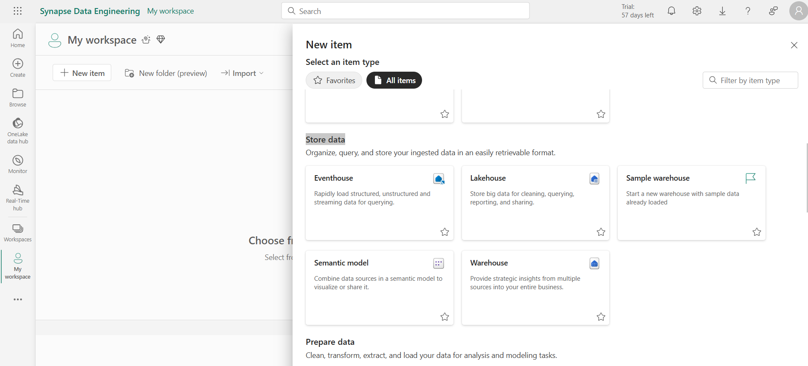

# Create Flashcards with Microsoft Fabric and Azure OpenAI

In this workshop, you will learn how to use [Microsoft Fabric](https://www.microsoft.com/microsoft-fabric) with [Azure OpenAI](https://azure.microsoft.com/products/ai-services/openai-service) to generate a set of study flashcards, so you can learn new concepts in a fun and playful way. 

In this example we will use [Microsoft Learn](https://learn.microsoft.com/training/) as the source material for the flashcards. 

We will fetch the Markdown files from the [Microsoft Learn GitHub repository](https://github.com/MicrosoftDocs/learn/) and import them into a Microsoft Fabric [Lakehouse](https://learn.microsoft.com/fabric/data-engineering/lakehouse-overview). 

Then we will use Azure OpenAI to generate a set of study flashcards. We will generate QR codes for each flashcard pointing to the source material. 

Finally, we will run [data pipelines](https://learn.microsoft.com/training/modules/use-data-factory-pipelines-fabric/) to copy the data to an external data store ([Azure Blob Storage](https://learn.microsoft.com/azure/storage/blobs/)) for public consumption. 

We will generate a ready to print PDF with your flashcards using the [Printable Flashcards Generator](https://martafagundez.github.io/printable-flashcards-generator/).


## Goals

You'll learn how to:

- Use Microsoft Fabric notebooks.
- Load data from an external data source into a Microsoft Fabric Lakehouse.
- Use Azure OpenAI to generate a set of study flashcards.
- Generate QR codes for each flashcard pointing to the source material.
- Run data pipelines to copy the data to an external data store (Azure Blob Storage) for public consumption.
- Generate a ready to print PDF with your flashcards.

## Pre-requisites

| | |
|----------------------|------------------------------------------------------|
| Azure account        | [Get a free Azure account](https://azure.microsoft.com/free) |
| Microsoft Fabric License | [Microsoft Fabric Licenses](https://learn.microsoft.com/fabric/enterprise/licenses) |
| A workspace in Microsoft Fabric | [Create a Microsoft Fabric workspace](https://learn.microsoft.com/fabric/data-warehouse/tutorial-create-workspace) |
| Access to Azure OpenAI API | [Request access to Azure OpenAI](https://aka.ms/oaiapply) |
| A Web browser        | [Get Microsoft Edge](https://www.microsoft.com/edge) |
| Python knowledge | [Python for beginners](https://learn.microsoft.com/training/paths/beginner-python/) |

---

# Environment Setup

In Azure Portal, you need to provision the following services:

**Azure OpenAI**. You will use it to generate the flashcards questions and answers.

**Azure Blob Storage**. You will use it to store the generated flashcards and QR codes. Once you have your Storage Account provisioned, make sure you enable `Allow Blob anonymous access` in the `Configuration` tab under `Settings`. The QR codes will be publicly accessible by the PDF generator app.

**Azure Key Vault (Recommended)**. You will use it to store your Azure OpenAI API key.

**Microsoft Fabric**. Create a new workspace for this workshop. You will use it to create a Lakehouse, run the notebooks, and the Data pipeline.

## Create a Lakehouse

Click `Workspaces` and select you workspace ie `My workspace`. Click new item and scroll to `Store data` and click `Lakehouse`



To create a new Lakehouse in your Microsoft Fabric workspace, open the Synapse Data Engineering experience and select the `Lakehouse` button. Provide a name of `flashcards_workshop` and select `Create`.


To learn more about Lakehouses in Microsoft Fabric, refer to [this Lakehouse tutorial](https://learn.microsoft.com/fabric/data-engineering/tutorial-build-lakehouse#create-a-lakehouse).


## Create a new notebook

Once you are in the new Lakehouse, create a new notebook by selecting `Open Notebook` and then `new notebook` from the drop down menu. 


Once the notebook is created, select the `Save as` icon and save the notebook as `flashcards_workshop`. 

# Import Data to your Lakehouse

Let's say we want to practice our knowledge on the [Get started with Real-Time Analytics in Microsoft Fabric](https://learn.microsoft.com/training/modules/get-started-kusto-fabric/?WT.mc_id=javascript-76678-cxa) module. The source material for this module is available in the [Microsoft Learn GitHub repository](https://github.com/MicrosoftDocs/learn/). In this case navigate to the module folder [learn-pr/wwl/get-started-kusto-fabric](https://github.com/MicrosoftDocs/learn/tree/main/learn-pr/wwl/get-started-kusto-fabric). There you will find an includes folder that contains the files in the module. This is a list all the modules in their respective Markdown files.


Copy the git repository URL. In this case, the URL is `https://github.com/MicrosoftDocs/learn/tree/main/learn-pr/wwl/get-started-kusto-fabric/includes`.

> **NB:** Please Note you can use any other Microsoft Learn module URL, but while copying the URL, make sure you are inside the `include` folder for this to work. i.e.
> - `https://github.com/MicrosoftDocs/learn/tree/main/learn-pr/wwl-data-ai/analyze-images-computer-vision/includes`
> - `https://github.com/MicrosoftDocs/learn/tree/main/learn-pr/wwl-data-ai/automl-azure-databricks/includes`


#### Install Dependencies

add the following code to the first cell to install qrcode library

```python
%pip install qrcode
```
We are going to use the qrcode library to generate the QR codes for the flashcards. We do this as a first step, because once the library is installed, the notebook will automatically restart the kernel to make the library available for the rest of the code.

### Copy the data to your Lakehouse
Add the following code to your notebook into a new cell:
```python
# 1. Set up variables and paths
from notebookutils import mssparkutils
import requests
import os
import re
import qrcode

# ----------------- User Input -----------------

# User Input: GitHub URL (Please make sure the Ms Learn URL Repo have includes folder ie below URL)
# GITHUB_URL = "https://github.com/MicrosoftDocs/learn/tree/main/learn-pr/wwl/get-started-kusto-fabric/includes"
GITHUB_URL = "<ENTER URL REPO>"

# ----------------- Parse GitHub URL -----------------

def parse_github_url(url):
    pattern = r"https://github\.com/(?P<owner>[^/]+)/(?P<repo>[^/]+)/tree/(?P<branch>[^/]+)/(?P<path>.+)"
    match = re.match(pattern, url)
    if match:
        return match.groupdict()
    else:
        raise ValueError("Invalid GitHub URL format.")

# Parse the GitHub URL
parsed_url = parse_github_url(GITHUB_URL)

OWNER = parsed_url['owner']
REPO = parsed_url['repo']

BRANCH = parsed_url['branch']
REPO_PATH = parsed_url['path']  # The path within the repo

# Define GitHub API URL
GITHUB_API_URL = "https://api.github.com/repos"

# For constructing the source URL, extract the module name
MODULE_NAME = os.path.basename(os.path.dirname(REPO_PATH))

# For local storage paths
LAKEHOUSE_FILE_PATH = "Files"
MARKDOWN_PATH = f"{LAKEHOUSE_FILE_PATH}/markdown"

# Adjust includes_folder_path
includes_folder_path = f"{MARKDOWN_PATH}/{REPO_PATH}"

# Verify the paths
print(f"includes_folder_path: {includes_folder_path}")
print(f"LEARN_MODULE_PATH: {REPO_PATH}")
print(f"MODULE_NAME: {MODULE_NAME}")

# ----------------- Download Functions -----------------

# Function to download and save files
def download_and_save_file(file_url, lakehouse_save_path):
    try:
        response = requests.get(file_url)
        if response.status_code == 200:
            # Create directories in Lakehouse if they don't exist
            dir_path = os.path.dirname(lakehouse_save_path)
            mssparkutils.fs.mkdirs(dir_path)
            # Save the file content to Lakehouse
            mssparkutils.fs.put(lakehouse_save_path, response.text, overwrite=True)
            print(f"Successfully downloaded {lakehouse_save_path}")
        else:
            print(f"Failed to download {file_url}: HTTP {response.status_code}")
    except Exception as e:
        print(f"Error downloading {file_url}: {e}")

# Function to recursively download contents
def download_contents(contents, base_save_path):
    for item in contents:
        if item['type'] == 'file':
            file_name = item['name']
            download_url = item['download_url']
            # Compute the relative path of the file within the module
            relative_path = item['path'].replace(REPO_PATH + '/', '')
            # Construct the Lakehouse save path
            lakehouse_save_path = f"{base_save_path}/{relative_path}"
            # Download and save the file
            download_and_save_file(download_url, lakehouse_save_path)
        elif item['type'] == 'dir':
            # Handle subdirectories recursively
            sub_dir_path = item['path']
            sub_api_url = item['url']
            sub_response = requests.get(sub_api_url)
            if sub_response.status_code == 200:
                sub_contents = sub_response.json()
                # Compute the new base save path for the subdirectory
                sub_base_save_path = f"{base_save_path}/{item['name']}"
                download_contents(sub_contents, sub_base_save_path)
            else:
                print(f"Failed to list contents of {sub_dir_path}: HTTP {sub_response.status_code}")

# Main execution
def main():
    # Construct the Lakehouse base save path for the module
    lakehouse_module_path = f"{MARKDOWN_PATH}/{REPO_PATH}"
    # Create the base directory in Lakehouse
    mssparkutils.fs.mkdirs(lakehouse_module_path)
    
    # Get the contents of the folder via GitHub API
    api_url = f"{GITHUB_API_URL}/{OWNER}/{REPO}/contents/{REPO_PATH}?ref={BRANCH}"
    response = requests.get(api_url)
    if response.status_code == 200:
        contents = response.json()
        download_contents(contents, lakehouse_module_path)
    else:
        print(f"Failed to list contents of {REPO_PATH}: HTTP {response.status_code}")
        print(f"Response: {response.text}")

# Run the main function
main()

# ----------------- List Markdown Files -----------------

# 2. List markdown files in the includes folder
if mssparkutils.fs.exists(includes_folder_path):
    file_list = mssparkutils.fs.ls(includes_folder_path)
    # Filter for markdown files
    md_files = [file_info for file_info in file_list if file_info.name.endswith('.md')]
else:
    print(f"Directory does not exist: {includes_folder_path}")
    md_files = []  # Handle the error accordingly

```
Run the cell.

Going forward, it is expected that you run each cell in the notebook to execute the code.

On the left side pane of the notebook, you should see the folder structure created in the Lakehouse. In the Explorer, select Lakehouses, then Files, and you should see the markdown folder tree structure we've just created and the markdown files in the includes folder.


If you go back to the Microsoft Learn GitHub repository, you will see that the Markdown files are stored in the `includes` folder. 


### Log Messages


Now that we have the folder structure in place, we can start downloading the Markdown files. If you look at the units in the `index.yml` file, you will see that each unit has a unique identifier. We can use this identifier to fetch the Markdown file from the Microsoft Learn GitHub repository. 


# Generate Flashcards using Azure OpenAI

Now that we have the Markdown files in our Lakehouse, we can use Azure OpenAI to generate a set of study flashcards.

## Setup Azure OpenAI

<div class="warning" data-title="Note">

> It is expected that you have access to Azure OpenAI, otherwise you can edit the code below to use any other OpenAI compatible API.

</div>

On your notebook, add the following code to install the openai library, run the following command:

```python
%pip install openai
```
To set up Azure OpenAI, add the following code to your notebook in a new cell:

```python
# ----------------- Set up Azure OpenAI Client -----------------

# Azure OpenAI configuration (replace with your actual credentials)

# If you have Azure Keyvault set up (uncomment the code below)
# from notebookutils.mssparkutils.credentials import getSecret
# KEYVAULT_ENDPOINT = "https://{your-vault}.vault.azure.net/"
# AZURE_OPENAI_API_KEY = getSecret(KEYVAULT_ENDPOINT, "your-openai-keyvault-secret-key")

# Else just use this code if you dont have Azure Keyvault setup
AZURE_OPENAI_API_KEY = "<YOUR_AZURE_OPENAI_API_KEY>"
AZURE_OPENAI_ENDPOINT = "https://<YOUR_AZURE_OPENAI_ENDPOINT>.openai.azure.com/"
AZURE_OPENAI_API_VERSION = "<YOUR_MODEL_VERSION>"
AZURE_OPENAI_CHAT_DEPLOYMENT = "<YOUR_DEPLOYMENT_NAME>"

# Setup Azure OpenAI 
from openai import AzureOpenAI

client = AzureOpenAI(
    api_key=AZURE_OPENAI_API_KEY,
    azure_endpoint=AZURE_OPENAI_ENDPOINT,
    api_version=AZURE_OPENAI_API_VERSION
)

deployment_name = AZURE_OPENAI_CHAT_DEPLOYMENT
```

## Create the Flashcards Prompt

To generate the flashcards, we need to provide a prompt to the Azure OpenAI API. The idea is to tell the model to generate questions based on the content of the Markdown files.

The flashcard PDF generator app expects a list with the following shape, containing our generated questions and answers:

```json
[
  {
    "id": "001",
    "question": "What is the history behind flashcards?",
    "answer": "Flashcards have been used as a learning tool since the 19th century, with their roots traced back to Germany.",
    "category_name": "History",
    "qr_url": "https://example.com/qrcodes/001.png"
  }
]
```

To generate a JSON like that, add the following code to your notebook in a new cell:

```python
# ----------------- Define the LearnAssistant Class -----------------

# Create the Flashcards Prompt
class LearnAssistant:

    def __init__(self, client, deployment_name):
        self._openai = client
        self._deployment_name = deployment_name

    def generate_questions(self, text):
        system_message = """
        You are an assistant designed to help people learn from tutorials. 
        You will receive a Markdown document, and extract from it pairs of questions and answers that will help the reader learn about the text. 
        Questions and answers should be based on the input text.
        Extract at least 5 different pairs of questions and answers. Questions and answers should be short.
        Output should be valid JSON format.
        Here's an example of your output format: [{"Q": "What is the name of the assistant?", "A": "Learn Assistant"}]
        """
        user_message = text

        return self.call_openai(system_message, user_message)

    def call_openai(self, system_message, user_message):
        response = self._openai.chat.completions.create(
            model=self._deployment_name,
            messages=[
                {"role": "system", "content": system_message},
                {"role": "user", "content": user_message}
            ]
        )

        return response.choices[0].message.content
```
The key part of this code is the prompt:

```python
"""You are an assistant designed to help people learn from tutorials. 
You will receive a Markdown document, and extract from it pairs of questions and answers that will help the reader learn about the text. 
Questions and answers should be based on the input text.
Extract at least 5 different pairs of questions and answers. Questions and answers should be short.
Output should be valid JSON format.
Here's an example of your output format: [{"Q": "What is the name of the assistant?", "A": "Learn Assistant"}]
"""
```

The idea is to tell the model to only generate questions and answers based on the input text. The model should generate at least 5 different pairs of questions and answers, and we provide a sample JSON format for the output, since that's what our code is going to use next.

## Generate the flashcards

```python
# ----------------- Generate the Flashcards -----------------

# List to keep track of the generated QAs
import json
import re
import uuid

# Azure Storage Account (replace with your actual storage account name & QR_Code container name in your storage account)
STORAGE_ACCOUNT = "flashcardsworkshop"
QRCODES_CONTAINER_NAME = "qr-codes"

QAS = []
flash_card_id = 1

# Initialize the LearnAssistant
assistant = LearnAssistant(client, deployment_name)

# Loop through each markdown file
for file_info in md_files:
    file_path = file_info.path

    # Read the file content using mssparkutils.fs.head
    try:
        if file_info.size > 0:
            content = mssparkutils.fs.head(file_path, file_info.size)
        else:
            content = ''
        
        # Generate questions and answers
        gen_qas = assistant.generate_questions(content)

         # Remove code block markers if present
        gen_qas = re.sub(r'^```(?:json)?\s*', '', gen_qas)  # Remove opening code block
        gen_qas = re.sub(r'```$', '', gen_qas)  # Remove closing code block

        # Trim the response
        gen_qas = gen_qas.strip()

        # Convert the generated questions and answers to a list
        try:
            temp = json.loads(gen_qas)
        except json.JSONDecodeError as e:
            print(f"Error decoding JSON for {file_info.name}: {e}")
            print(f"OpenAI Response: {gen_qas}")
            continue  # Skip to the next file
        
        # Get the base filename without extension
        base_name = os.path.splitext(file_info.name)[0]
        
        # Construct the source URL
        source_url = f"https://learn.microsoft.com/training/modules/{MODULE_NAME}/{base_name}"
        
        # Create the QR code URL pointing to your Azure Blob Storage account
        # qr_url = f"https://{STORAGE_ACCOUNT}.blob.core.windows.net/{QRCODES_CONTAINER_NAME}/{unique_filename}.png"
        
        # Add the generated QAs to the list
        for t in temp:
            

            # Generate a unique filename using UUID
            unique_filename = f"{flash_card_id}_{uuid.uuid4()}.png"
            
            # Create the QR code URL pointing to your Azure Blob Storage account with the unique filename
            qr_url = f"https://{STORAGE_ACCOUNT}.blob.core.windows.net/{QRCODES_CONTAINER_NAME}/{unique_filename}"
            
            card = {
                "id": flash_card_id, 
                "question": t["Q"], 
                "answer": t["A"], 
                "category_name": "Real-Time",
                "source_url": source_url,
                "qr_url": qr_url
            }
            QAS.append(card)
            flash_card_id += 1
    
    except Exception as e:
        print(f"Error processing {file_info.name}: {e}")
        continue  # Skip to the next file

# Convert QAS to JSON string
qas_json = json.dumps(QAS, indent=2)

# Define the path where you want to save the JSON file
GENERATED_QAS_PATH = f"{LAKEHOUSE_FILE_PATH}/generated-QAs.json"

# Save the generated QAs to a JSON file in the Lakehouse
try:
    mssparkutils.fs.put(GENERATED_QAS_PATH, qas_json, overwrite=True)
    print(f"Generated QAs have been saved to {GENERATED_QAS_PATH}")
except Exception as e:
    print(f"Error saving generated QAs: {e}")

```

As the code runs, you should see the generated questions and answers in the output. The questions and answers are stored in the `QAS` list, which is then saved in the Lakehouse to a JSON file called `generated-QAs.json`.

<div class="information" data-title="Note">

> A way to apply [Responsible AI](https://learn.microsoft.com/legal/cognitive-services/openai/overview) practices would be to review each question and answer generated by the model to ensure they are correct and relevant to the source material.

</div>

## Create the Flashcards QR Codes

Now that we have the questions and answers, we can generate QR codes for each flashcard. The QR code will point to the source material in the Microsoft Learn GitHub repository. In this way we follow [Responsible AI](https://learn.microsoft.com/legal/cognitive-services/openai/overview?WT.mc_id=javascript-76678-cxa) practices by providing the source material for each flashcard, so not only the user can learn more about the topic but also know where the LLM model got the information from.

Using the `qrcode` library we installed at the beginning, we can generate the QR codes for each flashcard. The source URL for the QR code is the URL to the Microsoft Learn module unit.

to install the qrcode library, run the following command:

```python
!pip install qrcode
```

## Generate the QR codes images

Using the `qrcode` library we installed at the beginning, we can generate the QR codes for each flashcard. The source URL for the QR code is the URL to the Microsoft Learn module unit.

Add the following code to your notebook in a new cell to generate QR codes: 

```python
# ----------------- Generate the QR Codes -----------------

# Path to store QR codes in Lakehouse
import tempfile
import qrcode

QR_CODE_PATH = f"{LAKEHOUSE_FILE_PATH}/qrcodes"
mssparkutils.fs.mkdirs(QR_CODE_PATH)

# Loop through each flashcard and generate a QR code
for qa in QAS:
    qr = qrcode.QRCode(
        version=1,
        error_correction=qrcode.constants.ERROR_CORRECT_L,
        box_size=10,
        border=4,
    )
    qr.add_data(qa["source_url"])
    qr.make(fit=True)

    img = qr.make_image(fill_color="black", back_color="white")

    # Save the QR code image to a temporary local file
    with tempfile.NamedTemporaryFile(suffix='.png', delete=False) as tmp_file:
        img.save(tmp_file.name)
        tmp_file_path = tmp_file.name
    
    # Extract the unique filename from the QR URL
    qr_filename = qa["qr_url"].split('/')[-1]

   # Define the Lakehouse path where the QR code image will be stored using the unique filename
    qr_file_path = f"{QR_CODE_PATH}/{qr_filename}"

    # Copy the local file to the Lakehouse using mssparkutils.fs.cp()
    # The local file path needs to start with "file:"
    local_file_uri = f"file:{tmp_file_path}"

    mssparkutils.fs.cp(local_file_uri, qr_file_path, recurse=False)

    # Optionally, delete the temporary file
    os.remove(tmp_file_path)

print("Flashcards and QR codes generation completed.")
```

You should be able to message to show  modules were downloaded successfully


openai will generate the questions and answers for the modules


If you go back to the Lakehouse Explorer, you should see the QR codes in the qrcodes folder. Select the three dots next to the qrcodes folder and select Refresh to see the files. To see the QR codes in the qrcodes folder. Select the three dots next to the qrcodes folder and select Refresh to see the files.


To display the cards in a tabular format, run the following code:

```python
# Display the QA in the JSON file
import pandas as pd
from io import StringIO
from IPython.display import display

# Read the JSON content from the Lakehouse
qas_content = mssparkutils.fs.head(GENERATED_QAS_PATH)
df = pd.read_json(StringIO(qas_content))

# Function to make URLs clickable
def make_clickable(val):
    return f'<a href="{val}" target="_blank">{val}</a>'

# Apply the function to the 'source_url' and 'qr_url' columns
# Optionally, hide the index or set 'id' as index
# Set 'id' as index to avoid duplicate numbering
df.set_index('id', inplace=True)

# Create the Pandas Styler
styler = df.style.format({'source_url': make_clickable, 'qr_url': make_clickable})

# Hide the index if desired
# styler = styler.hide_index()

# Left-align all columns
styler = styler.set_properties(**{'text-align': 'left'})

# Alternatively, you can specify alignment for specific columns
# styler = styler.set_properties(subset=['question', 'answer', 'source_url', 'qr_url'], **{'text-align': 'left'})

# Adjust the header alignment
styler = styler.set_table_styles([{
    'selector': 'th',
    'props': [('text-align', 'left')]
}])

# Display the DataFrame with clickable links and left-aligned text
display(styler)
```
With the above code, you should see the flashcards in a tabular format. The `source_url` and `qr_url` columns are clickable links that will open in a new tab.


To see the qr codes, run the following code:

```python
# Display all QRCODES
from pyspark.sql.functions import input_file_name
from IPython.display import Image, display

# Define the path to the QR codes in the Lakehouse
LAKEHOUSE_FILE_PATH = "Files"  # Adjust if different
QR_CODE_PATH = f"{LAKEHOUSE_FILE_PATH}/qrcodes"

# Read the QR code images as binary files
df = spark.read.format("binaryFile").load(f"{QR_CODE_PATH}/*.png")

# Collect the image data
image_data_list = df.select("content").collect()

# Display the images
for image_data_row in image_data_list:
    image_data = image_data_row.content
    display(Image(data=image_data))
```

Try scanning the QR code with your phone to see how it leads to the source material in Microsoft Learn.


---

# Create a Fabric Data Pipeline

Now that we have the flashcards and the QR codes, we can run a [data pipeline](https://learn.microsoft.com/training/modules/use-data-factory-pipelines-fabric/) to copy the data to an external data store ([Azure Blob Storage](https://learn.microsoft.com/training/modules/explore-azure-blob-storage/)) for public consumption.

Select the `Home` button to go back to the Data Engineering experience. Select `Data pipeline` to create a new data pipeline. Give it the name `flashcards_pipeline`, and then select `Create`.


## Copy the QR Codes to Azure Blob Storage

In the pipeline, select `Pipeline activity` to start building the pipeline with a blank canvas. In the contextual menu, select "Copy data" to add a new activity.


- Name the activity `Copy QR Codes to Azure Blob Storage`.
- Give a description of the activity.


In the source dataset, select the following options:
- Connection : select `flashcards_workshop`
- Root folder: `Files`
- File path type : browse inside `qrcodes` folder
- File path: `QR Codes`
- File format: `Binary`


Let's shift to Azure and create a storage account to store the QR codes.

Destination : this is where we will copy the data to.

- On azure create a storage account, name = `flashcardsstorage`, Primary service = Azure Blob Storage or Azure Data Lake Storage Gen2, perfomance = Standard, Replication = Locally-redundant storage (LRS), Access tier = Hot, Networking = Public endpoint, Encryption type = Microsoft managed key, Tags = None, Review + create, Create.


- Go `settings`, under `configuration` enable `Allow Blob anonymous access`


- Go to the storage account and select `Containers` and create a new container
- name `qr-codes`
- Anonymous access level : `Blob(Anonymous read access for blobs only)` 
- Do the same for container name `generated-qas`. Make sure to select `Blob(Anonymous read access for blobs only)` 


- Copy your Access key and the storage account name = `flashcardsstorage` and go back to the pipeline.


Back to the pipeline, in the destination dataset, select the following options:

- Connection : click more and search for `Azure Blob Storage`


- connect data destination: add account name = `flashcardsstorage`, authentication kind = `Account key`, Account key = `your copied access token`


Let's continue with the destination configuration
- Add the container name :`qr-codes`
- click `Run` to save and start the pipeline.
- Make sure the pipeline runs successfully.


- Go to the storage account and select the container `qr-codes` to see the copied QR codes.


## Copy the JSON Data to Azure Blob Storage

Repeat the same process to copy the JSON data to Azure Blob Storage.
- In the same pipeline, go to `activities`, `copy data`, and `add to canvas`.
- In general, give a name = `Copy JSON file to Azure Blob Storage`, description = `Copy JSON file to Azure Blob Storage`
- Source dataset: connection = `flashcards_workshop`, root folder = `Files`, file path = generated-QAs.json, file format = `JSON`, filepath(containers) = `generated-qas`, file format = `JSON`
- Destination dataset: connection = your previous connection, file path = `generated-qas`, file format = `JSON`
- Go to home menu.
- click `Run` to save and start the pipeline.
- Make sure the pipeline runs successfully.


Once the pipeline is finished, you can go to your Azure Blob Storage account and see the files copied there in generated-qas container.


---

# Generate a PDF with the Flashcards

In your Azure Blob Storage account, go to the containers pane. You should see the `qrcodes` and `json` folders with the QR codes and the JSON file. Now we are going to generate a PDF with the flashcards.


Download the `generated-QAs.json` file to your local machine.

To generate the PDF, we are going to use a [Printable Flashcards Generator](https://martafagundez.github.io/printable-flashcards-generator/). This tool allows you to generate a PDF with the flashcards by providing a JSON file with the questions and answers. **Make sure to star the repository on GitHub!**


## Open the Printable Flashcards Generator

Go to the [Printable Flashcards Generator](https://martafagundez.github.io/printable-flashcards-generator/) and select the `Choose file` button. Browse to the `generated-QAs.json` file you just downloaded from your Azure Blob Storage account.

In the menu on the left select "PRINT". Make sure the Layout is set to "Landscape", that paper size is "A4", and that Margins are set to "None".


You can now save the PDF file to your local machine. You can print the PDF and cut the flashcards to have a physical set of flashcards to study.


---

# Conclusion

This concludes this workshop, we hope you enjoyed it and learned something new.

In this workshop, you learned how to use Microsoft Fabric and Azure OpenAI to generate a set of study flashcards. You connected Fabric to Azure Blob Storage to store the flashcards and QR codes. You generated a PDF with the flashcards.

## Clean up resources

<div class="important" data-title="Important">

> After completing the workshop, remember to delete the Azure Resources you created to avoid incurring unnecessary costs!

</div>

## Resources

To learn more about Retrieval Augmented Generation (RAG) using Azure Search an Azure OpenAI, refer to the following resources:

- [Retrieval Augmented Generation (RAG) in Azure AI Search](https://learn.microsoft.com/azure/search/retrieval-augmented-generation-overview)
- [Use Azure OpenAI in Fabric with Python SDK and Synapse ML (preview)](https://learn.microsoft.com/fabric/data-science/ai-services/how-to-use-openai-sdk-synapse)
- [Azure OpenAI for big data](https://microsoft.github.io/SynapseML/docs/Explore%20Algorithms/OpenAI/)